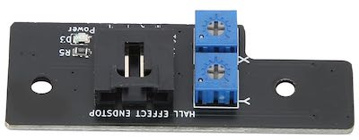
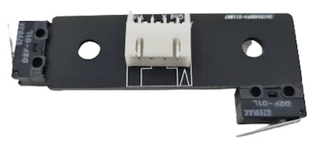
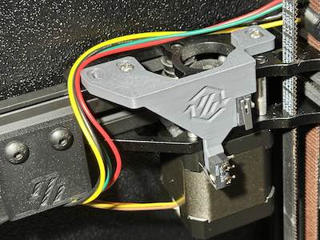

# Endstops

There are a few options availble for x/y endstops. All options remove the X chain as it's not used with SC at all.

1. Hall Effect: Using the normal Voron X/Y Join hall effect board, download and print the [Hall_Effect.stl](Hall_Effect.stl) or [Hall_Effect_Shuttlekepper.stl](Hall_Effect_Shuttlekepper.stl) if you are use shuttle keeper.  
2. Switches: Using the normal Voron X/Y Join switch board (both switches are on the x/y join together like hall effect.  Download and print the [Hall_Effect.stl](Hall_Effect.stl) or [Hall_Effect_Shuttlekepper.stl](Hall_Effect_Shuttlekepper.stl) if you are use shuttle keeper, this will add the needed surface for the X switch to hit.  
3. Relocated Switches: This will relocate both X/Y to the rear A Motor brackets.  This has the added benefit of removing the Y chain completely.  Download and print [[a]_switch_bracket.stl]([a]_switch_bracket.stl) and [[a]_switch_arm.stl]([a]_switch_arm.stl).  
4. Sensorless: Of course you always have the option of sensorless homing for X/Y which also allows you to completely remove the Y chain.  But you have less wires and nothing to print in this case.
