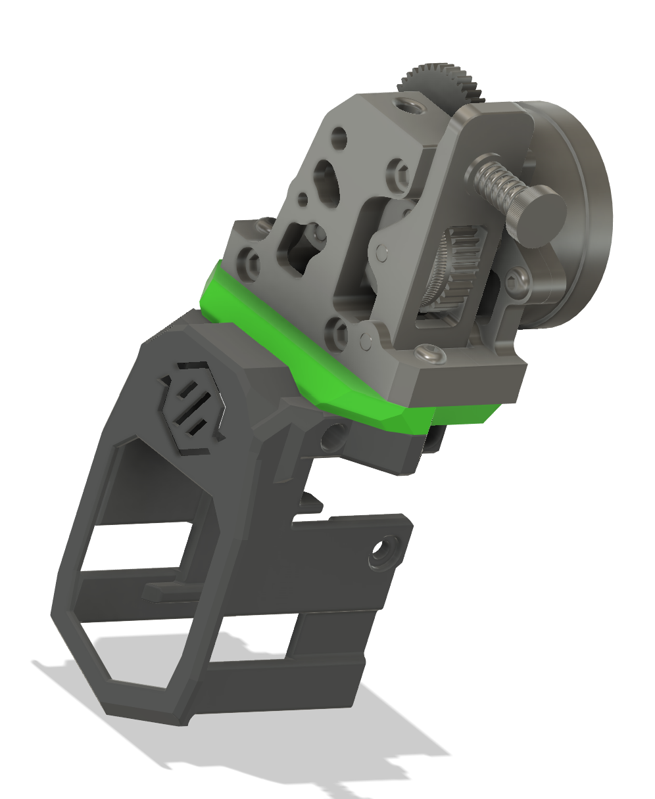

 - There is an improved printing version of N3MI's Voron Sherpa spaced Stealhchanger main body. No supports needed.
 - Also, there is yet another version with the following changes:
  - Same easier printing as above.
  - Relaxed the side spacing on the diffuser/PCB. They fit in much easier without struggle.
  - More spacing for the clip above the PCB. My PCB was slightly bigger than the model, so it wouldn't fit.
  - Yet more spacing above the clip. I know what you are thinking, but yup. This was to accommodate a new diffuser that did not have the LED divots. It was too hard to print with resin with those. 
 - New thinner diffuser without the divots. This is NOT a direct replacement. You will need the above main body for it to work. Much easier to print in resin.
 - Next mod is an HGX adapter plate. This fits any of anthead sherpa spacing bodies. You really don't need this unless you want to run the wires up the back. Even then, you might want to think long and hard. Its here if you really think you want it.

	

If you have questions about any of my mods, you can find me on the Stealthchanger Discord. 

