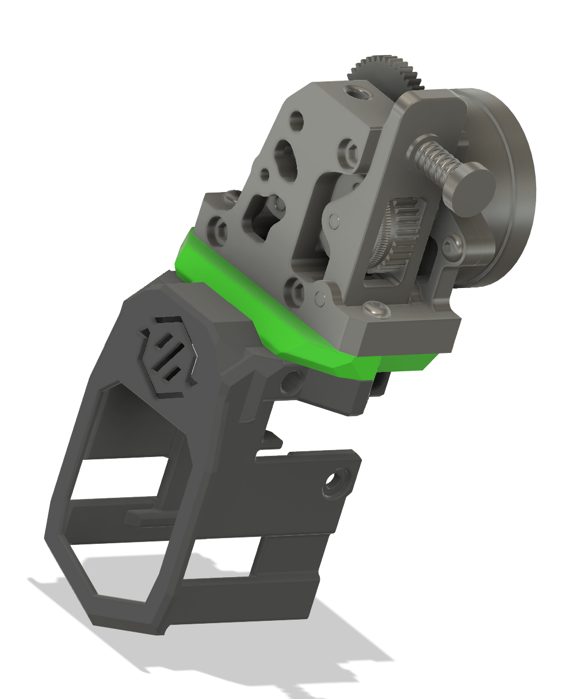

Anthead Mods
	

 - There is an improved printing version of N3MI's Voron Sherpa spaced Stealthchanger main body. No supports needed.
 - Second version of N3MI's main body with more space above the diffuser/PCB. Read that folder for more info.
 - Thin SC diffuser for resin printing.
 - HGX adapter plate. This fits any of the anthead sherpa spacing bodies. You really don't need this except if you want to run the wires up the back.

	

If you have questions about any of my mods, you can find me on the Stealthchanger Discord. 
