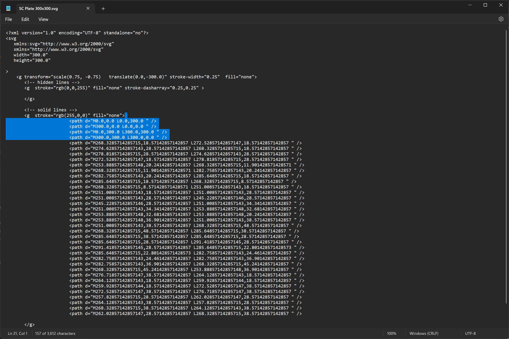
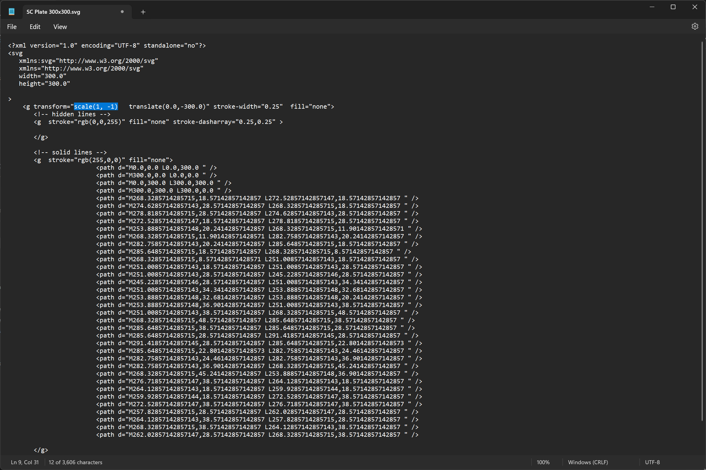

# How to Make a Custom Size Build Plate Texture
This is a short step by step tutorial on how to make your own plates for a custom size <br>

### Programs Used
* Cad Query
* Inkscape
* Note Pad (file editor)

## Steps
1. Load the "Micron SC Build Plates.py" or "SC Build Plates.py" 
    * edit the 'X' and 'Y' variables for your dimensions
        ```
        # Build Plate Dimensions
        X = 180
        Y = 180
        ```
    * fill in the export destination, line 37 (Micron) or 40 (SC); and replace the `<YOUR_OUTPUT_DEST>` with your file path using `/`
    <br>
2. Either run the file in cq-editor or execute it via command line
3. Open the SVG Export with Notepad so we can remove the perimeter, and fix the scale
    * Delete these lines &darr; 
    * Change the values in the `Scale(x, y)` to be `X=1` and `Y=-1` &darr; 
    <br>
4. Open the Modified SVG in Inkscape and use the fill tool on each section of the logo with this hex `#db3f38`
<br>
<br>
That's it! now you can make your own build plate .svg's, Also ps if you want to try a different logo I just gave RAW .dxf's to Chat GPT and asked it to convert the to poly lines for Cad Query!