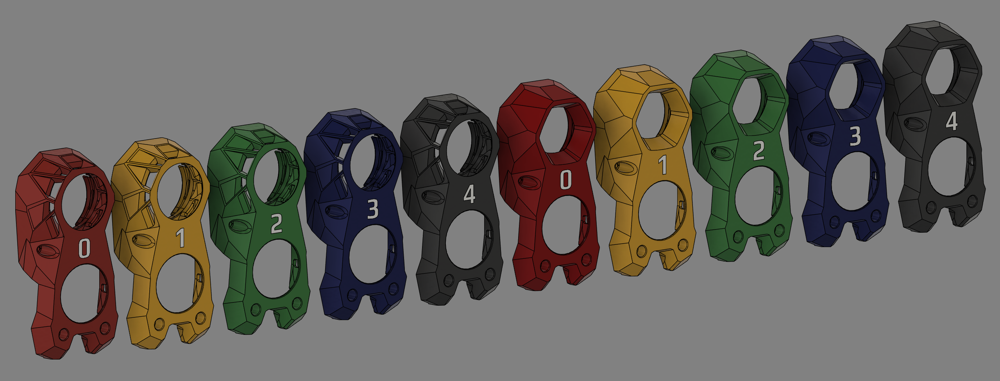

# Stealthburner Number Cowls
These are modified cowls for the Stealthburner toolhead featuring tool numbers in place of the voron logo. They are multi body STLs so you will NEED a tool changer or MMU (AMS) to print these. 

## Materials
You will need Transparent ABS/ASA for the numbers as the cowl is requires it, and this will be single multi color print. Each cowl will require the "Stealthburner LED Carrier.stl" which is in the STL directory, although will no longer need the "[c]_stealthburner_LED_diffuser.stl" and   "[o]_stealthburner_LED_diffuser_mask.stl".  ("Stealthburner LED Carrier.stl" has been renamed from "[o]_stealthburner_LED_carrier.stl" which you may already have)

## Printing
When you're slicing load each ALL the STLs from one of the tool folders at once, then click "yes" for "single body multiple parts" and then assign you colors/tools. This will have to be done one at a time for every tool you have, so I recommend downloading the entire folder which will keep them organized. below are folder download links for the 2 cowl types. To make you transparent sections better print with 100% infill and concentric pattern on all faces (top, bottom, infill). 
> [Download Knomi Cowls Folder](https://download-directory.github.io/?url=https://github.com/Dumplap/StealthChanger/tree/main/UserMods/Dumplap/Stealthburner%2520Number%2520Cowls/.stl/Knomi%2520Cowls) 
> [Download Original Cowls Folder](https://download-directory.github.io/?url=https://github.com/Dumplap/StealthChanger/tree/main/UserMods/Dumplap/Stealthburner%2520Number%2520Cowls/.stl/Original%2520Cowls)

&nbsp;

## Credits
Thanks to VORON Design for the Stealthburner toolhead and BigTreeTech for the Knomi and then Stealthburner Cowl.