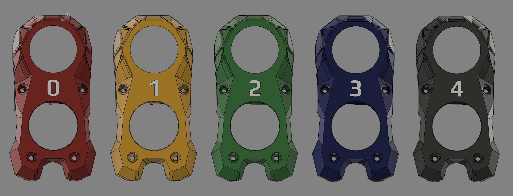

# Stealthburner Number Cowls
These are modified cowls for the Stealthburner toolhead featuring tool numbers in place of the voron logo. These are multi body STLs so you will NEED a tool changer or MMU (AMS) to print these. 

## Materials
You will need Transparent ABS/ASA for the numbers as the cowl is requires it, and this will be single multi color print.

## Printing
When you're slicing load each ALL the STLs from one of the tool folders at once then click "yes" for "single body multiple parts", and then assign you colors/tools. To make you transparent sections better print with 100% infill and concentric pattern

