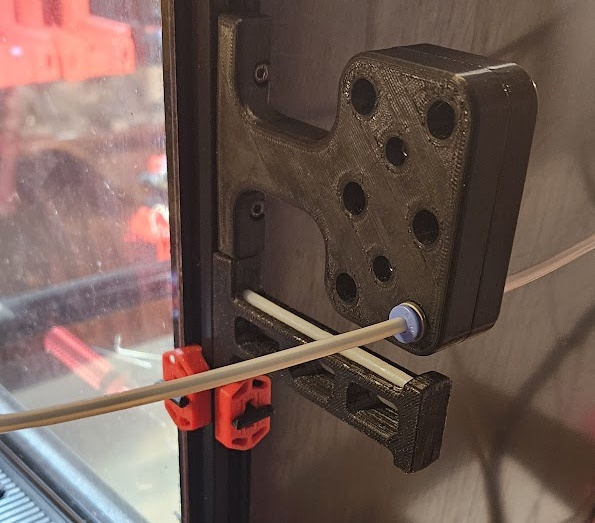
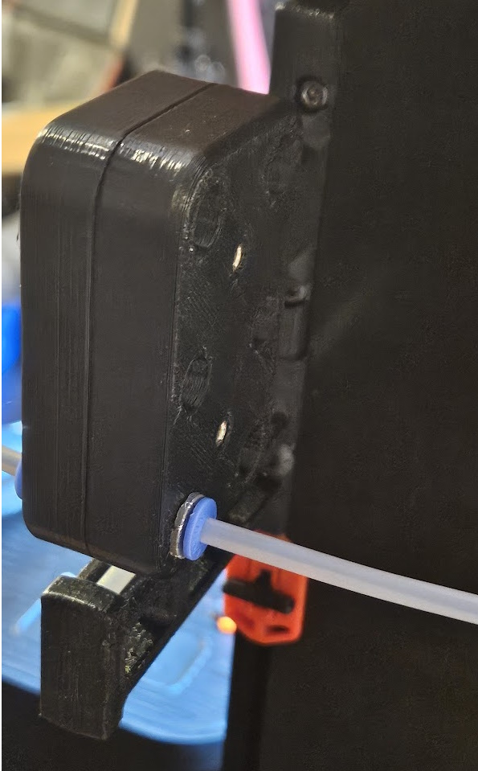

# PTFE Breakout Block

## What is it?
I designed the Breakout Block with the following idea in mind:
* Similar "lenght" than the stock Voron Spool Holder so it maintain existing clearance for people using the original setup
* Provide some constrain to the PTFE so it doesn't king when using 3mm innder diameter
* use ECAS because they are practical for this purpose
* Optional, seconary part that serve as a breakout block, allowing to "detach" easily both side of the block to decouple the toolhead and the spool holder when doing printer maintenance

## Special Notes
The design is probably not perfect but it was good enought for me at this point.

## Files
* [Main part v3.1](Flisher-PTFE_Breakout_Block_Main-v3.1.stl)
* [Secondary Part v3.1](Flisher-PTFE_Breakout_Block_Secondary-v3.1.stl)
* [Step File](Flisher-Toolchanger-PTFE-Holder-v3.1.STEP)

## BOM
* 2x M3 T-Nuts or Roll-in Nuts
* 2x M3x12 SHCS Screws 
* 1x ECAS Connector per Lane you want activate

If using both parts
* 2x M3x16 SHCS Screws (Voron Sandard)
* 2x M3 heat insert (Voron Sandard)
* Additional 1x ECAS Connector per Lane you want activate (ie: 12 totals if using 6 toolheads)

## Instructions
### Main Part
* Validate that your PTFE can go trought easily, if not, you might have to deburr rthe side facing the bed.
* Install the ECAS connectors
* Screw to the back of the printer using M3 T-Nuts and M3x12 SHCS Screws

You can stop here if you only wanted something to constrain the filament path and use it as a passtrought

### Secondary part
* Validate that your PTFE can go trought easily, if not, you might have to deburr rthe side facing the bed.
* Install the ECAS connectors
* Install the 2 heats inserts (on the same side than the ECAS connector)
* Install on the main block by using 2x M3x16 SHCS Screws
* Push the PTFE coming from the main part as it can get 2mm inside 
* Attach the PTFE from the printer side
  
You now have a setup you can decouple by pulling the filament back to the spool holders and unscrewing the block.

### Additional Pictures

## Changelog
* V3.1 2024-03-24 - Initial Release, each parts are 12mm wide