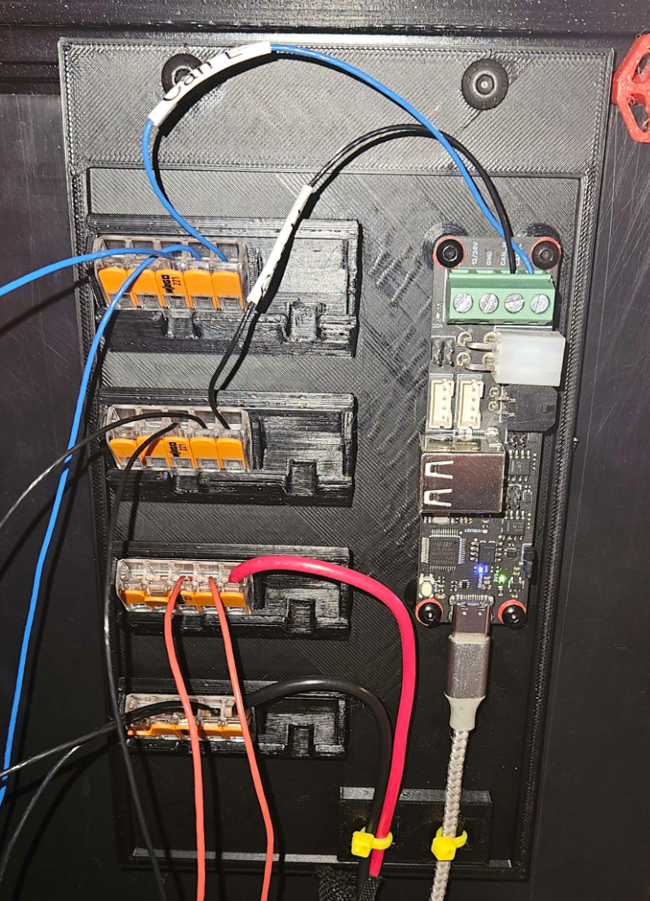

# Temporary Backplate

## What is it?
Very rought backplate that support some electronic, it's naked, not intented to be a final solution, but a good placeholder while working on other stuff.
This is not intended to be your final setup, but is a nice placeholder while figuring everything out.

## Feature
* Allow 4x 5+3 WAGO slot
* 2 Zip Tie Channel to secure the USB and 24V/GND wiring
* Slot for a USB2CAN

## BOM
* 4x M3 Heat Insert
* 4x M3 Screws

## Special Notes
This is not a perfect design, but it allow to work, use WAGO even if it's your final goal, and play with wiring.

# DISCLAIMER
You need to be carefull to not short stuff while playing around, always shut down power with the switch before touching stuff with this.

## Files
* [Backplate v2 - STL File](Flisher-Temporary_Backplate-V2.STL)
* [Backplate v2 - Step File](Flisher-Temporary_Backplate-V2.STEP)

## Credits:
The original idea come from **gdachs** Backpanel showcased on the Voron Tool Change Discord server, but my version is independant from the exaust port.
Original design can be found at https://cad.onshape.com/documents/60014468b9b72e460b456067/w/f3137b097c5c1d080a4612b0/e/ff5c83f39f6ad8db1b8a2981

