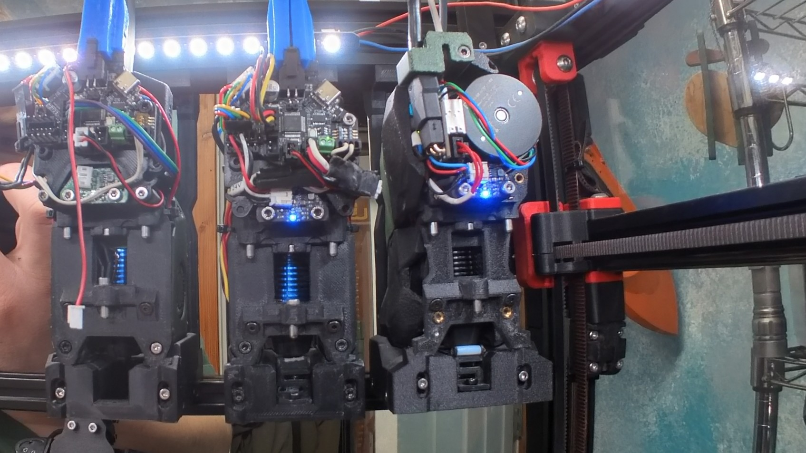
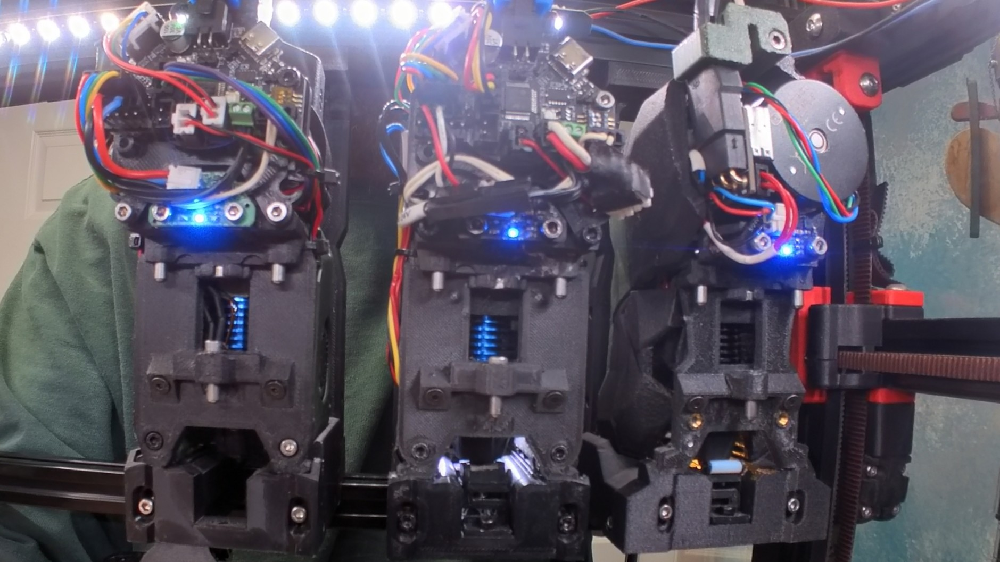
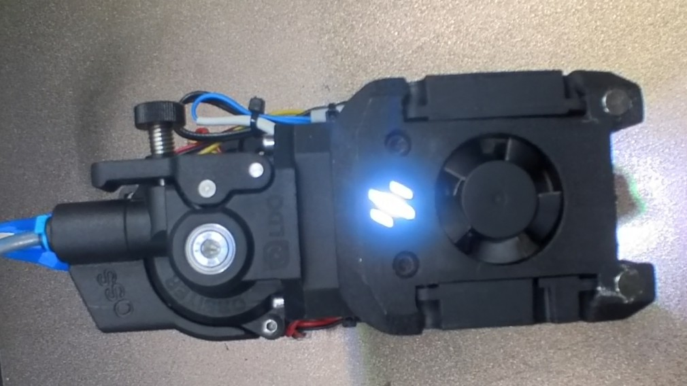
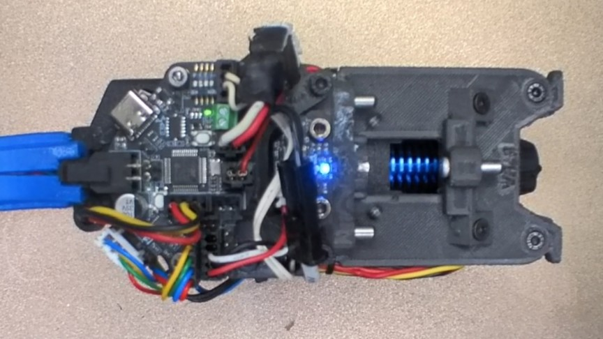
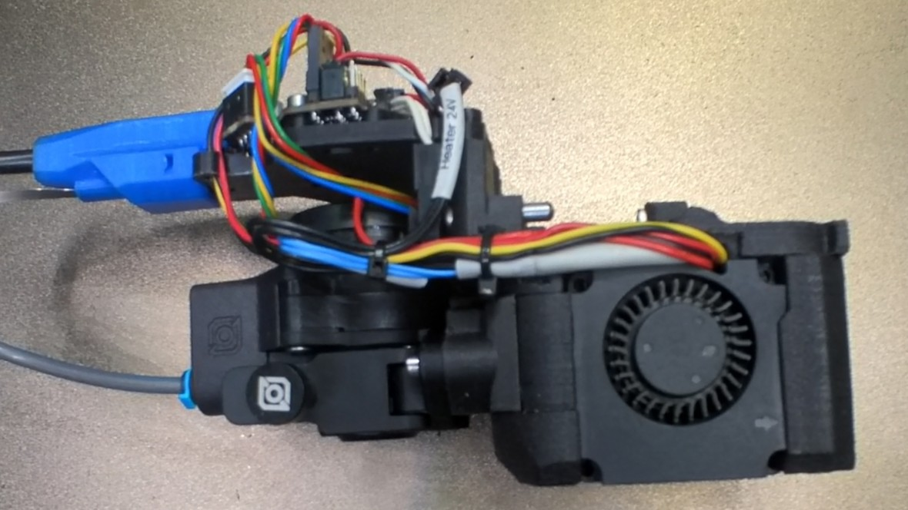
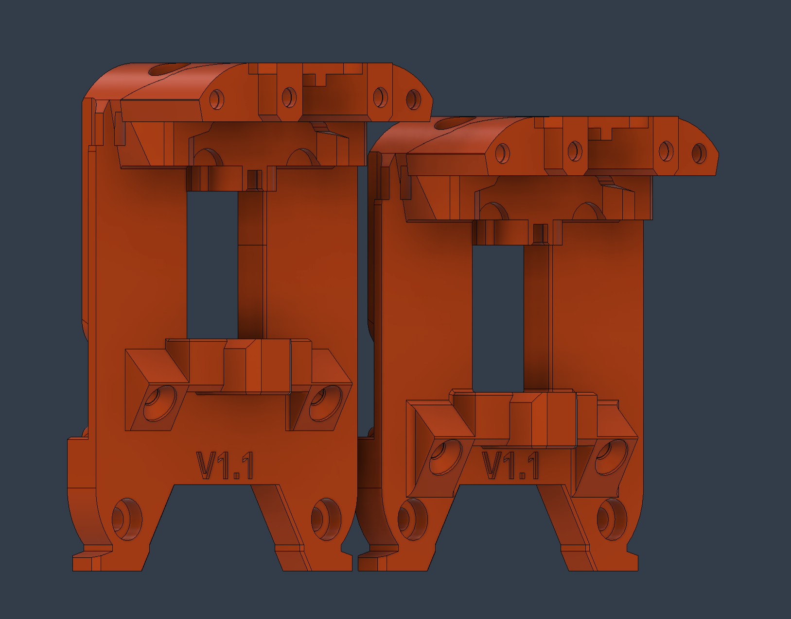
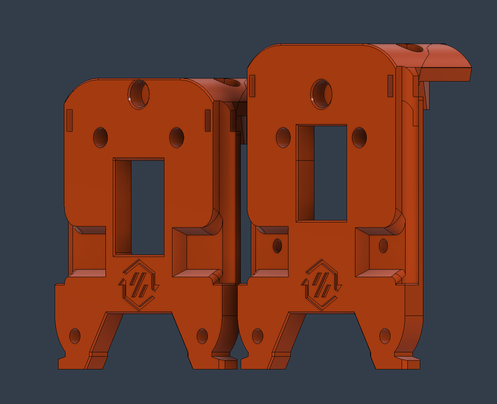
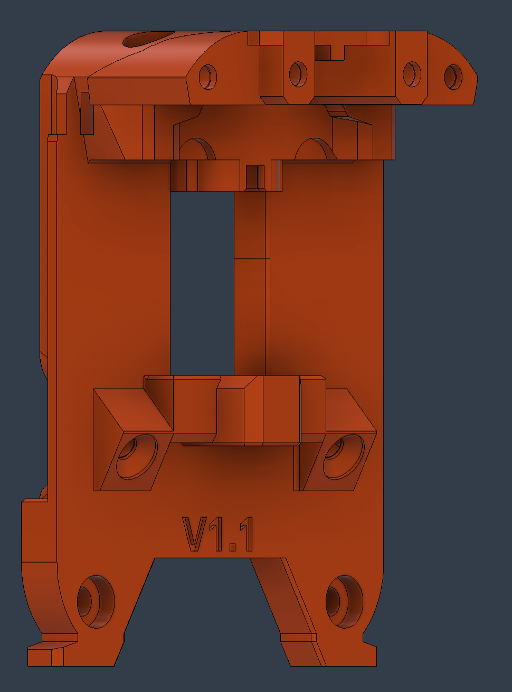
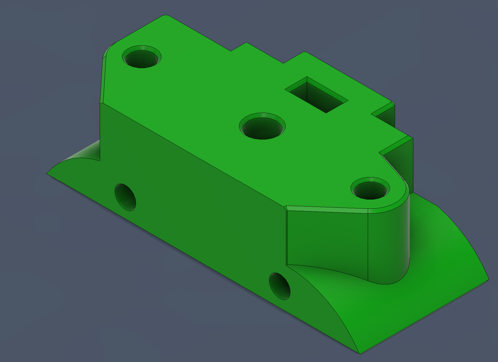

### Information:

  My Anthead was knocking my Dragon Burner out of its dock when picking it up. 
  So I move the pins on the Dragon Burner up 8mm to be more in line with my other tools.  

### My Modifications:

  I modified the [back plate](https://github.com/DraftShift/StealthChanger/blob/main/CAD/Backplates/DragonBurner.step))  cad files from the Draftshift design github. The [Orbiter V2.0 Spacer](https://github.com/zruncho3d/nudge/tree/main](https://github.com/chirpy2605/voron/tree/main/V0/Dragon_Burner/CAD)) was modified from the official
  Dragon Burner github cad files. 

### BOM:

  Backplate hardware should be the same. 8mm longer screws are needed for the Orbiter V2.0.

  ### Pictures:
  
  Before
  
  
  
  After
  
  
  
  Front
  
  
  
  Rear
  
  
  
  Side
  
  
  
  Modified Left Original Right Rear View
  
   
  
  Modified Right Original Left Front View
  
  
  
  Backplate
  
  
  
  Spacer
  
  
  

### License: 

  (Shared the same as the original) 
  
  Both original files are shared under the GPL-3.0 license

  GNU General Public License v3.0 

  ✖ | Sharing without ATTRIBUTION
  
  ✔ | Remix Culture allowed
  
  ✔ | Commercial Use
  
  ✔ | Meets Open Definition
  
  ℹ | Share under the same license
  

