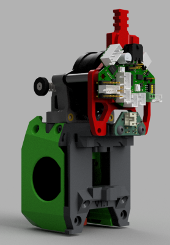
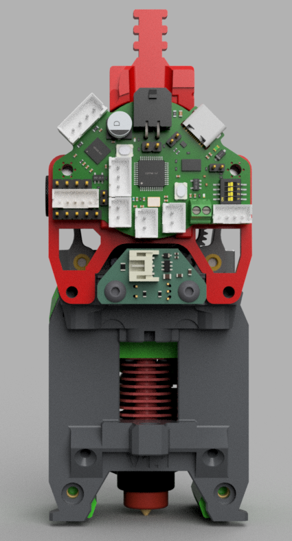

# A PCB Mounting solution for Anthead with Sherpa Mini and EBB36
## Purpose
Whilst building my Stealthchanger Voron 2.4, my focus was being cable and cost effective, utilising some parts I had on hand
and to keep cost down without compromising on capability and quality.  This lead me down the path of using Anthead, TZ V6 2.0,
Sherpa Mini and BTT EBB36 toolhead board. This appears to be a pretty common combination but there was an issue with the extruder
rotating on the Y Axis and the toolhead board mounts allowed the board to vibrate on the Y and Z axis.  TheSin- had created amazing
mounting solution for Orbitor 2 and an LGX based extruder which I have based this mod off of. 

## What does it achieve?
TheSin-'s design connects the toolhead board to the backplate and the extruder to ensure rigidity and lack of movement, this mod does
the same thing.  This mod also takes into account component placement on the toolhead board utilising key positioned stand offs to ensure
the board triangilated on the mount. I have also included a backplate spacer to facilitate cable routing and the toolhead board mount has
cutouts to route wires through.  An additional bonus is that it braces the extruder preventing rotation and reducing vibrations.

[!WARNING]
It may work for other 36 style boards but no promises. The cad (fusion360) is there if you want to modify things to suit your toolhead board.

## What do I need to print and hardware
The backplate, the backplate spacer and the toolhead board PCB Mount.  The EBB36 comes with 2 x 20mm brass stand offs which are screwe
between the extruder and the PCB Mount/PCB 

  

# Credits
[TheSin-](https://github.com/TheSin-) for the base I worked from
[N3MI-DG](https://github.com/N3MI-DG) @Myrkalear [@Nic335](https://github.com/nic335) , [jdmontgomer](https://github.com/jdmontgomer) @strothgar for pointing out these amazing designs, inspiring me and being top people
