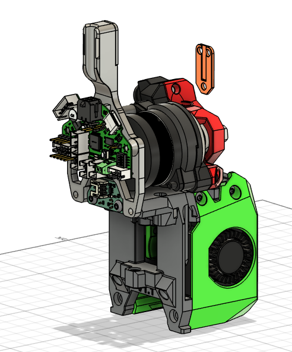

# A PCB Mounting solution for Anthead with Sherpa Mini and EBB36
## Purpose
Someone reached out commenting on my build which led to the discussion of his planned build being Anthead SF, WWG2 and EBB36 Gen2. This appears to be a pretty common combination but there was no quick easy solution for mounting, so I created one.  TheSin-[^1] had created amazing mounting solution for Orbitor 2 and an LGX based extruder which I have based this mod off of. 

## What does it achieve?
TheSin-'s design connects the toolhead board to the backplate and the extruder to ensure rigidity and lack of movement, this mod does
the same thing.  This mod also takes into account component placement on the toolhead board utilising key positioned stand offs to ensure
the board triangilated on the mount. An additional bonus is that it braces the extruder preventing rotation and reducing vibrations.

>[!WARNING]
>It may work for other 36 style boards but no promises. The cad (fusion360) is there if you want to modify things to suit your toolhead board.

## What do I need to print and hardware
The backplate, the backplate spacer and the toolhead board PCB Mount.  The EBB36 comes with 2 x 20mm brass stand offs which are screwe
between the extruder and the PCB Mount/PCB 

 

[^1]: https://github.com/DraftShift/StealthChanger/tree/main/UserMods/TheSin-/PCB36_Mount
# Credits
[TheSin-](https://github.com/TheSin-) for the base I worked from,
[N3MI-DG](https://github.com/N3MI-DG), @Myrkalear, [@Nic335](https://github.com/nic335), [jdmontgomer](https://github.com/jdmontgomer) and @strothgar for pointing out these amazing designs, inspiring me and being top people
