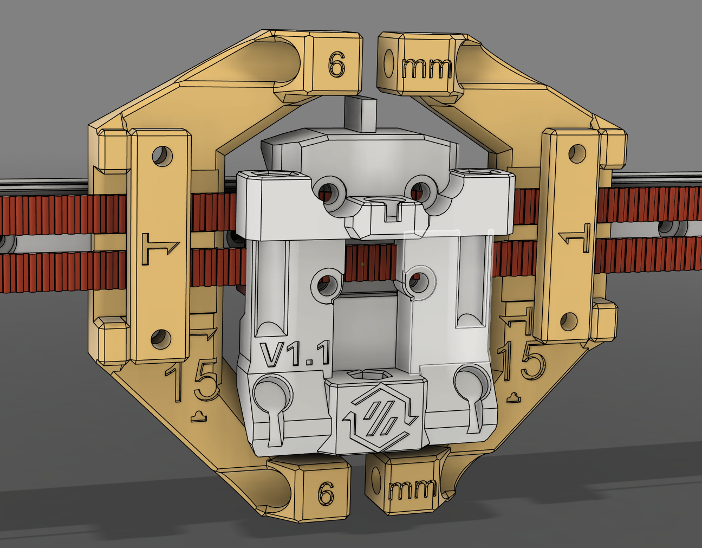

# Belthelper 3mm Spacing (Micron, V0, etc.)

In order to save y space and make it easier to attach belts to the shuttle backside you can use these clips to hold and tension all 4 belts.

You need to have 15 belt bumps visible from the belt clip on each belt. This should leave the center beltline on the shuttle free and give equal clamping to all belts.

The distance between both block at the tensioner screws should be 6mm between them when everything is "set" and the shuttle is ready to screw on. This is all according to cad and you might have to adjust the spacing to fit your prints. Hence the tensioning screws.

**Note:** Belts must be equal length before you start the process.