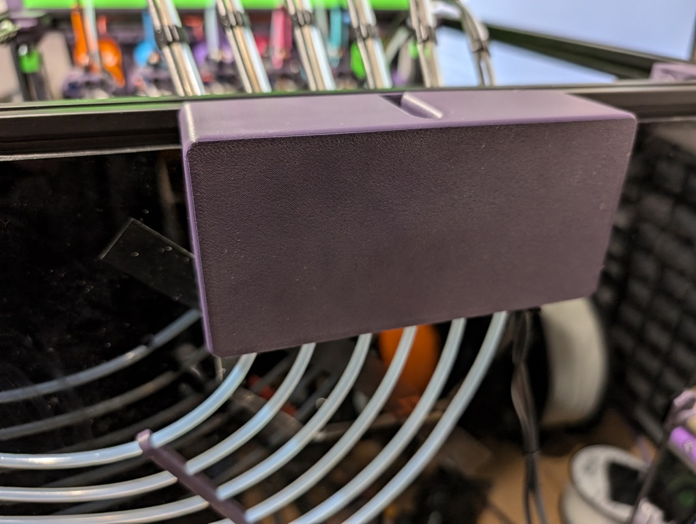
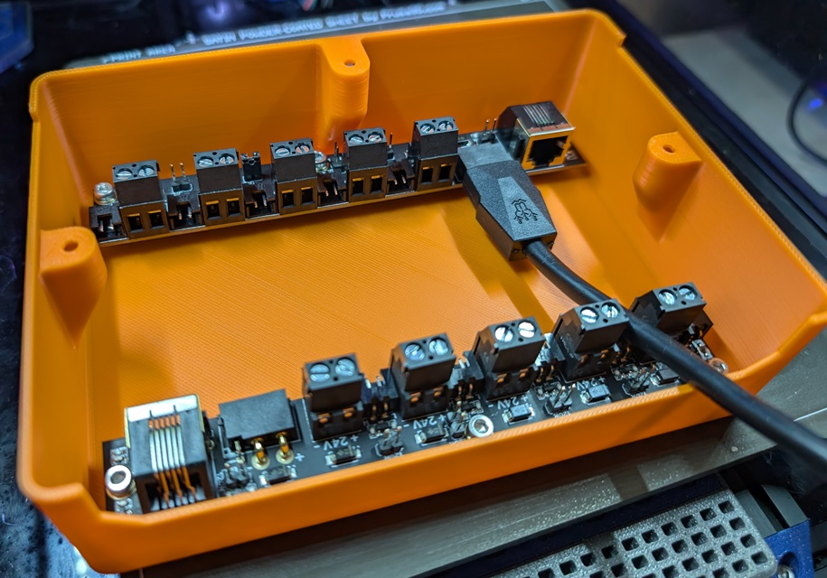
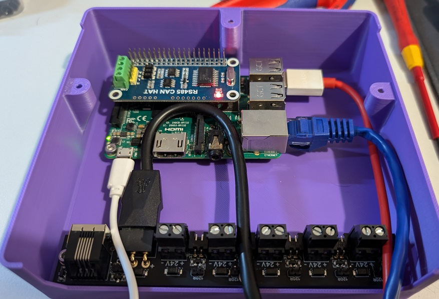

## CAN Board Cover

This modular cover can be used to house your CAN board and help tidy up some of the wiring. It is intended to be used with [my umbilical plate mod](https://github.com/DraftShift/StealthChanger/tree/main/UserMods/N3MI-DG/Umbilical_Plates "Umbilical Plates"). There is support for many configurations and panel sizes.

There is support for 3, 3.5, 4, 4.5 & 5mm panels with the following boards.

- BTT CEB
- BTT CEB x2
- BTT U2C
- BTT U2C + CEB
- FLY UTOC
- RPI + CEB

### BOM

- M3x6mm SHCS x2
- M3x8mm SHCS x1
- M3 post install T slot nut or hammer nut x1
- You will also need M3x6 screws to mount the PCBs

