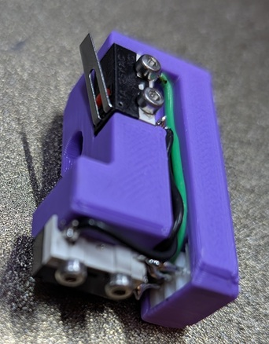

# Endstop Mounts

This repository contains designs for three types of shuttle:

- **Fysetc**: For the Fysetc CNC shuttle.
- **LDO**: For the LDO CNC shuttle.
- **3D Printed**: The 3D printed V1.1 Shuttle.

## Table of Contents

- [Overview](#overview)
- [Bill of Materials (BOM)](#bill-of-materials)
  - [A Drive Endstop Mount BOM](#a-drive-endstop-mount-bom)
  - [3D Printed BOM](#3d-printed-bom)
  - [Fysetc & LDO BOM](#fysetc--ldo-bom)
- [Installation](#installation)
  - [A Drive Endstop Mount](#a-drive-endstop-mount)
  - [Fysetc & LDO CNC Shuttles](#fysetc--ldo-cnc-shuttles)
  - [3D Printed Shuttle](#3d-printed-shuttle)
- [Configuration](#configuration)

## Overview

The switches for this solution are located in a block that mounts to the rear extrusion of the gantry and sits in the standard A motor mount. The 2 CNC versions have both alignment guides and an endstop bracket. The 3D printed version has only the endstop bracket.

## Bill of Materials

### A Drive Endstop Mount BOM

- **4** M2x10 Self tapping screws
- **1** M3x30 SHCS screw
- **1** 2020 Drop in T-Nut
- **2** D2F_L Microswitches
- **1** JST XH 3 Pin Male Header

### 3D Printed BOM

- **1** M3x10 SHCS screw
- **1** M3x25 SHCS screw

### Fysetc & LDO BOM

- **1** M3x10 SHCS screw
- **1** M3x20 SHCS screw
- **1** M3x30 SHCS screw

## Installation

### A drive Endstop Mount

1. Install the switches using the 4 M2x10 self tapping screws.

2. Push the JST HX header into the back hole, bend the NC (normally connected) pin of the bottom switch so that it aligns with the JST header pin and solder them together.

3. Solder wires connecting both C (common) pins on the switches to a single pin on the JST XH header. Solder a wire connecting the remaining NC pin on the top switch and the last JST HX pin.

4. Install the 2020 drop in T-nut into the front of the rear gantry extrusion and secure the endstop mount into the A drive with the M3x30 SHCS screw.

### Fysetc & LDO CNC Shuttles

1. Press in the guide pieces from the front in to their respective holes making sure they are seated all the way.

2. Mount the endstop bracket to the rear of the shuttle with the M3x10 SHCS and M3x20 SHCS screws screwing into the alignment guides. Because you are screwing in to plastic, be sure not to overtighten.

3. Install and adjust the M3x30 SHCS screw so that it cannot hit the B motor and aligns with the bottom switch on the A drive endstop mount.

### 3D Printed Shuttle

1. Mount the endstop bracket to the rear of the shuttle with the M3x10 SHCS.

2. Install and adjust the M3x25 SHCS screw so that it cannot hit the B motor and aligns with the bottom switch on the A drive endstop mount.

## Configuration

Ensure that you have `homing_rebound_y` in the `[toolchanger]` section of your config set to zero and `sensorless_x` & `sensorless_y` set to false.
