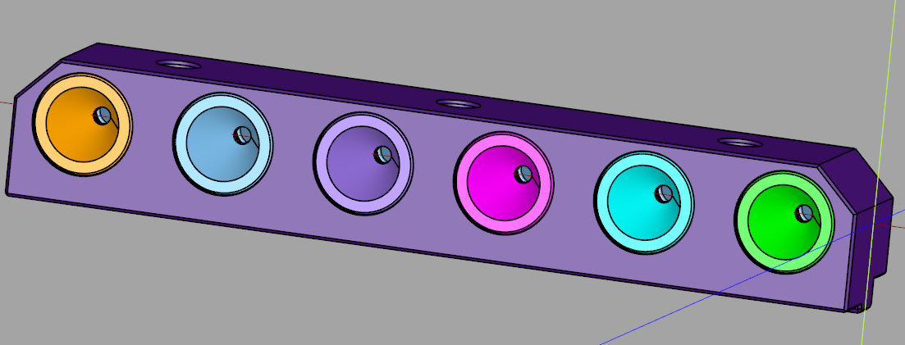
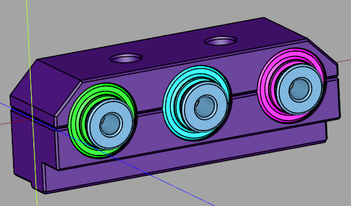
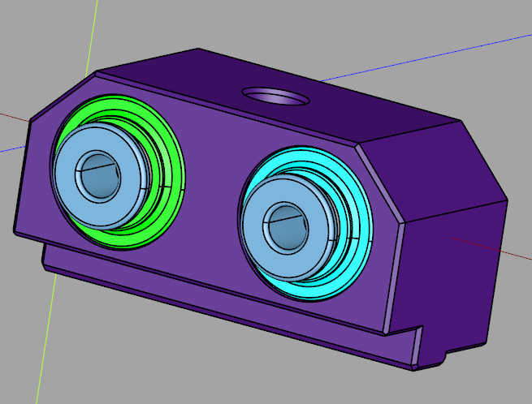
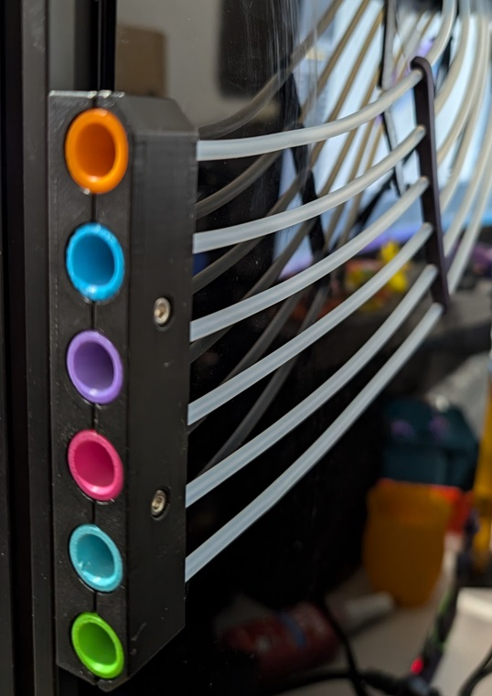
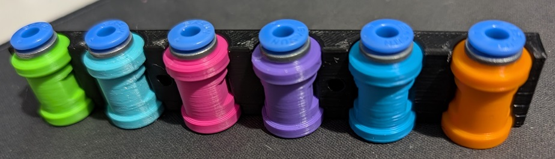

# Toolchanger Filament Entry

There are many different combinations that are possible for this mod. Pick what suits you best.

Measure the depth of your panel to frame before printing and choose between the 3, 3.5, 4, 4.5 & 5mm versions.
Choose how many tools to support. You can print multiple to have Bowden tubes exit either side of the printer for example.
Choose the version you want, there are 2 to choose from. Split and Solid.
The solid version is complete and can be printed in 1 piece.
The split version gets printed in separate pieces and then assembled (Better for multiple colours).

[CadQuery](https://github.com/CadQuery/cadquery, "CadQuery") source code is also available.

## BOM

- ECAS04 for each tool
- M3x20 SHCS screws (3 for 6 tool, 1 for 2 tool and 2 for the rest)
- M3 hammer nut (3 for 6 tool, 1 for 2 tool and 2 for the rest)

