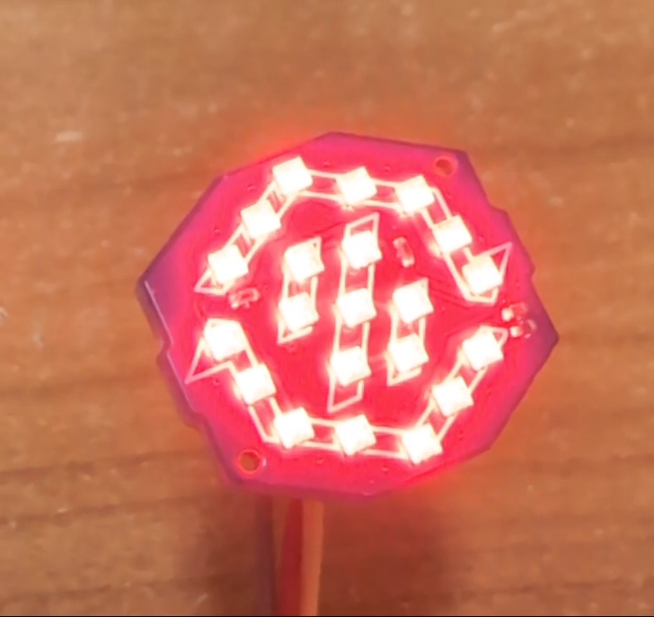
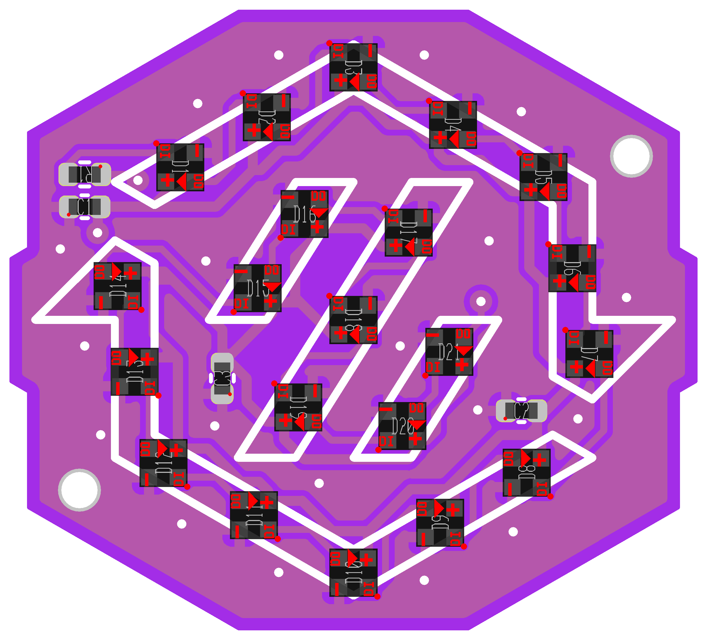
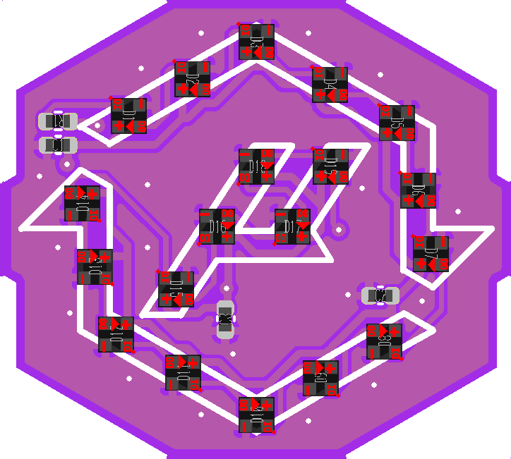

# SC Barf LEDs

PCBs with 1.5mm RGB LEDs arranged into the StealthChanger logo pattern, both Voron and Micron styles.



## Example Config

```text
[neopixel rgb_logo]
pin: PB3
color_order: GRB
chain_count: 21 # 21 for Voron style, 17 for Micron style.
initial_RED: 0.3
initial_BLUE: 0.0
initial_GREEN: 0.3
```

## How to Order from JLCPCB

- Add Gerber zip file
- Select the PCB qty you want
- Select the PCB color you want
- Select `Order Number(Specify Position)`
- Enable PCB Assembly
- Select `Added by Customer` in the Tooling holes section
- Press the `Next` button
- Press the next `Next` button
- Add BOM file `BOM-JLC.csv`
- Add CPL file `CPL-JLC.csv`
- Click the `Process BOM & CPL` button
- Make sure the selected componants are correct
- Click the `Next` button
- Confirm componant placement
- Click the `Next` button
- Save to cart & checkout.

Note. there is an alternative RGB led componant that can be selected if the `SK6805-EC15` is out of stock. `DY-S1515065/RGBC/6805-5T` by TONYU is 1:1 compatible but the JLC footprint is rotated 180 degrees. Confirm you have the correct orientations.

### SK6805-EC15


