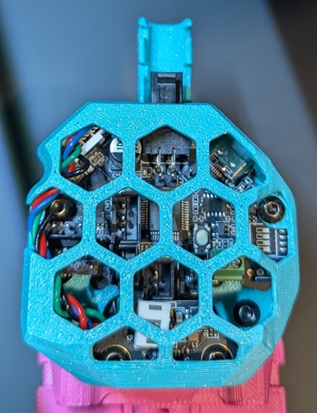

## Sherpa Micro EBB36 Mount With Cover

This mount was specifically designed to suit Sherpa Micro on a Yavoth toolhead. The cover has built-in supports which can be removed by pring off with a sharp knife.

   
  