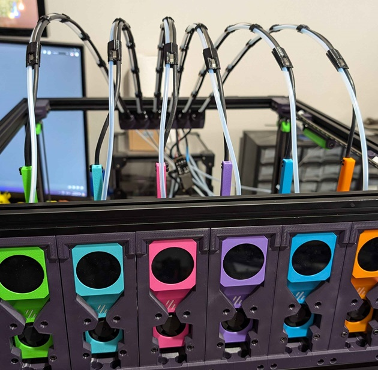
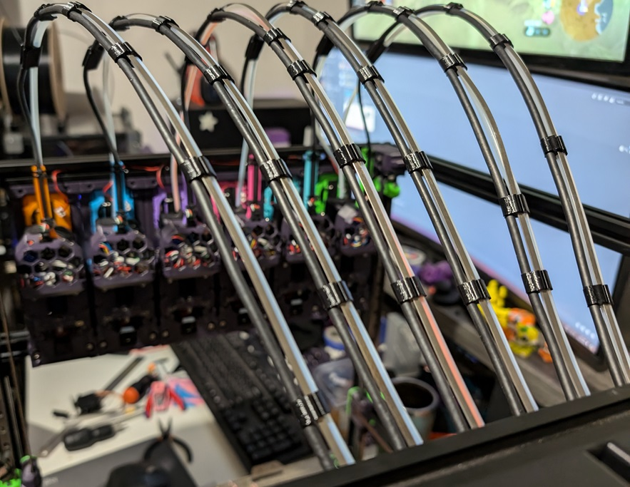
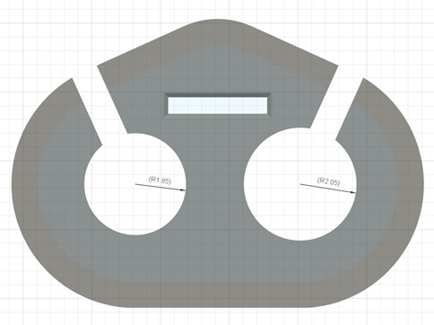
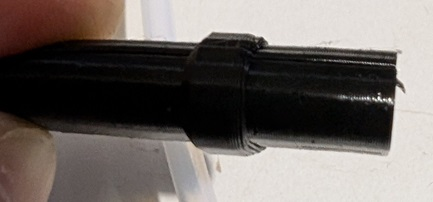
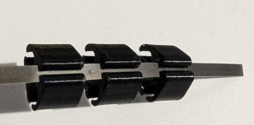
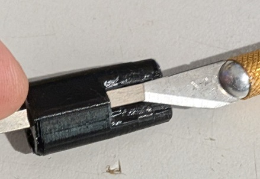
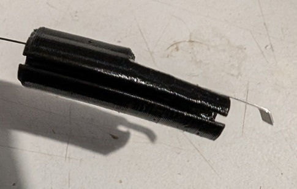
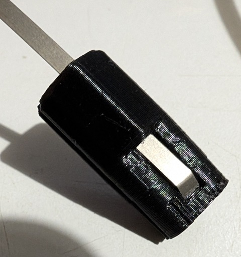
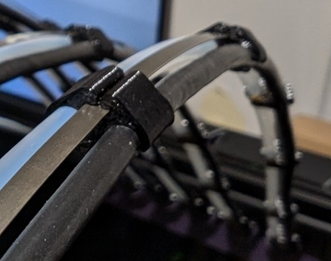
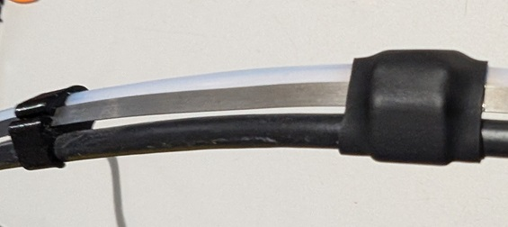

# Spring Steel Umbilical

This mod of the [Tapchanger umbilical system](https://github.com/viesturz/tapchanger/tree/main/Umbilical "Tapchanger Umbilical") come about because I was having trouble tools that dock close to the frame getting their umbilicals caught under the top extrusion. This mod uses  flat spring steel that forces the umbilical to return straight up and has proven to be much more reliable on my tool changer. In combination with [My back plate mod](https://github.com/DraftShift/StealthChanger/tree/main/UserMods/N3MI-DG/Umbilical_Plates "Back Plates") the umbilical cables follow a straight path from the back of the printer to the dock.

## PRINTED PARTS (per tool)

The following parts should all be printed from TPU.

- 1x Strain Relief.
- 1x Terminator.
- 4-6x Clip.

## BOM (per tool)

- 0.3mm Spring Steel. This can be sourced from [Aliexpress (0.3x3x2160mm is enough for 4 umbilical cables)](https://www.aliexpress.com/item/1005006731615186.html "Flat Spiral Coil Constant Force Springs Various Sizes")
    I used 430mm for a 300mm V2.4 (roughly the diagonal length of the bed).

- Heatshrink (optional)

## Instructions

Take note of the hole diameters in the printer pieces. The larger hole is intended for the bowden tube and the smaller hole for the repurposed USB cable.

___
Insert the spring steel through the strain relief and bend the end 2-3mm with needle nose plyers to roughly 30-45 degrees. If you bend too much the spring steel will snap.

___
Feed the spring steel through all of the clips being mindful of their orientation (match the hole sizes to the strain relief).

___
Feed the spring steel through the termination part until it pokes out a little. You may need to use a sharp object to help it past the ridge in the printed part.

___
Bend the end of the spring steel similarly to the strain relief end and then pull the bend back over the termination part until its sitting in the cutout.

___
Mount the bowden tube and cable in the strain relief and inset the strain relief into the plate.
This is the time to determine the length you need. With the strain relief inserted in the back plate, run your cable to the tool while it is at the largest travel position for that specific tool. For instance, T0 would be at MAX_X and MIN_Y, The last tool would be at MIN_X and MIN_Y.
Make sure that at that position there is minimal slack, but there should be some. You do not want the umbilical to be putting strain on the toolhead.
Then work your way back from the toolhead and insert the bowden tube and cable into the termination print, and then the clips (which can be spaced evenly). If at any point there is too little or too much slack, pull out the strain relief and adjust it.

___

Optionally you can put heat shrink over the clips to help keep them in place, as they can move over time.

