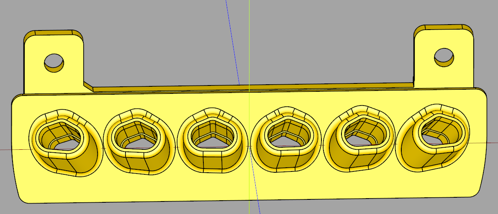
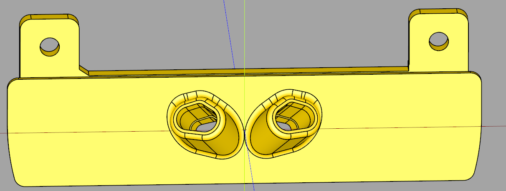

### TC Umbilical back plate
Parametric umbilical entry plates that are compatible with the [Tapchanger umbilical system](https://github.com/viesturz/tapchanger/blob/main/Umbilical/ "Tapchanger Umbilical").

With these plates the umbilical gets directed perfectly towards the dock. The supplied filed assume the docks are spaced evenly across the x axis. Single umbilicals go straight out.

If you require custom positioning for the docks or umbilical spacing, the [CadQuery](https://github.com/CadQuery/cadquery, "CadQuery") source has been included.

Credits goto [viesturz](https://github.com/viesturz), and [Voron Design](https://github.com/VoronDesign) for the originals, on which these plates are based.

Cheers.

