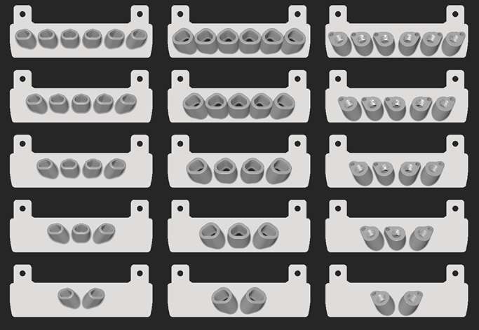

# Parametric Umbilical Plates

With these plates the umbilical gets directed perfectly towards the dock. The supplied files assume the docks are spaced evenly across the x axis. Single umbilicals go straight out.

This mod is intended to be used with my [umbilical restraints](https://github.com/DraftShift/StealthChanger/tree/main/UserMods/N3MI-DG/Umbilical_Restraints) and [can covers](https://github.com/DraftShift/StealthChanger/tree/main/UserMods/N3MI-DG/CAN_Cover)

There are 3 different styles.

- Regular. Compatible with [viesturz' Tapchanger umbilicals](https://github.com/viesturz/tapchanger)
- Large. Use this version for Nitehawk and larger cables.
- PG7. Can be used with either 1mm piano wire or 0.3x3mm spring steel.

If you require custom positioning for the docks or umbilical spacing, the [CadQuery](https://github.com/CadQuery/cadquery, "CadQuery") source has been included.

Credits goto [viesturz](https://github.com/viesturz), and [Voron Design](https://github.com/VoronDesign) for the originals, on which some of these plates are based.

Cheers.
