# TPU Umbilical Restraints

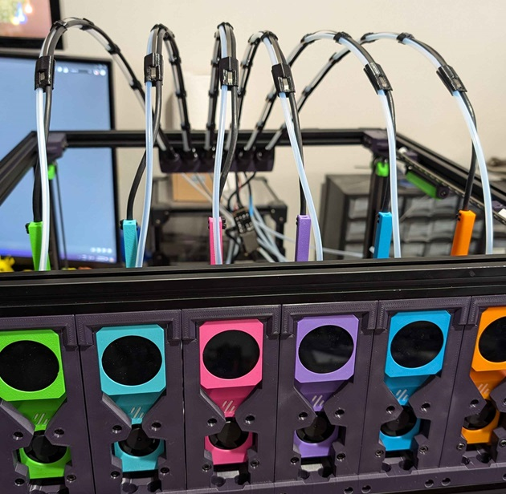

There are 3 factors in determining which files you need.

- The style of umbilical plate you are using (Regular Or Large). [Link](https://github.com/DraftShift/StealthChanger/tree/mod_updates/UserMods/N3MI-DG/Umbilical_Plates)
- The type of umbilical support you are using (1mm piano wire or [0.3x3mm flat spring steel](https://www.aliexpress.com/item/1005006731615186.html))
- The cable diameter you are using.

You need to print 1 Relief, 1 Terminator and enough Clips to keep your umbilical tidy (typically 4-6) per tool.
If you have a cubed build volume the spring steel/piano wire length should be the diagonal length of your bed + enough material for bending.

## Spring Steel
Insert the spring steel through the strain relief and bend the end 2-3mm with needle nose plyers to roughly 30-45 degrees. You can heat the end of the spring steel with a flame to stop it from snapping. If there is too much friction you can add a dab of dishwashing liquid as a lubricant.
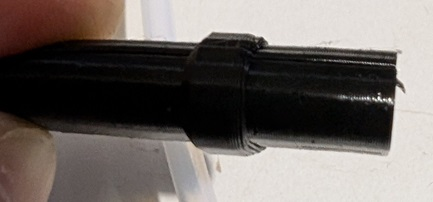
___
Feed the spring steel through all of the clips being mindful of their orientation (match the hole sizes to the strain relief). Note: older style clips pictured.
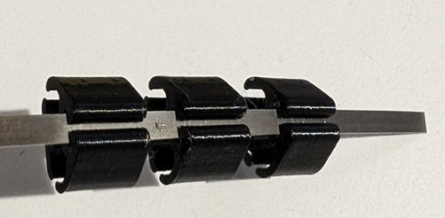
___
Feed the spring steel through the termination part until it pokes out a little. You may need to use a sharp object to help it past the ridge in the printed part.
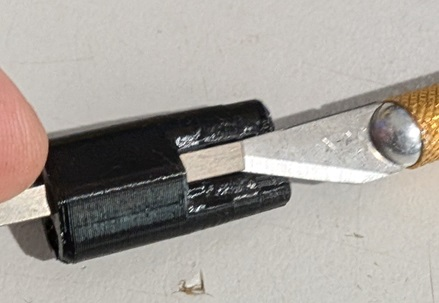
___
Bend the end of the spring steel similarly to the strain relief end and then pull the bend back over the termination part until its sitting in the cutout.
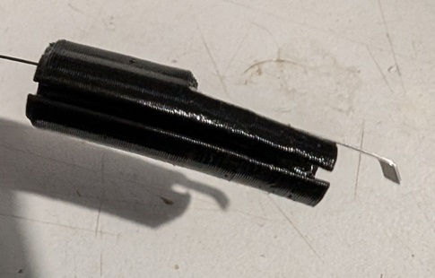
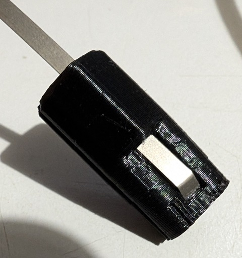
___
Mount the bowden tube and cable in the strain relief and inset the strain relief into the plate.
This is the time to determine the length you need. With the strain relief inserted in the back plate, run your cable to the tool while it is at the largest travel position for that specific tool. For instance, T0 would be at MAX_X and MIN_Y, The last tool would be at MIN_X and MIN_Y.
Make sure that at that position there is minimal slack, but there should be some. You do not want the umbilical to be putting strain on the toolhead.
Then work your way back from the toolhead and insert the bowden tube and cable into the termination print, and then the clips (which can be spaced evenly). If at any point there is too little or too much slack, pull out the strain relief and adjust it.
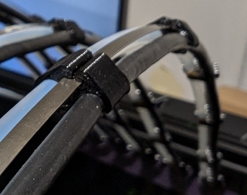
___

Optionally you can put heat shrink over the clips to help keep them in place, as they can move over time.
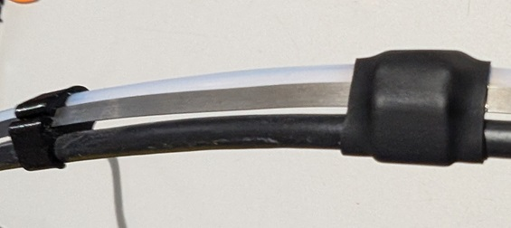

## Piano Wire
Much the same as spring steel except the wire gets 2 90 degree bends at the Relief and Terminator.
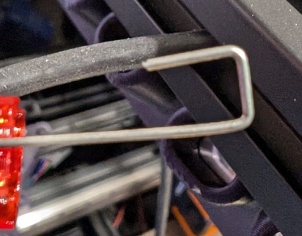
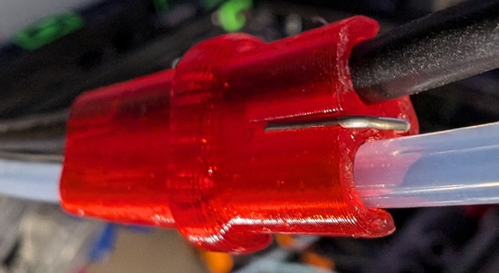
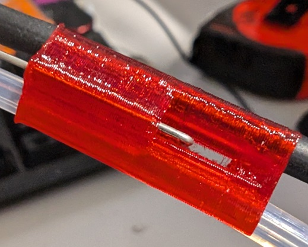

___

Credit to [viesturz](https://github.com/viesturz) for the original Tapchanger version by which these were inspired.
