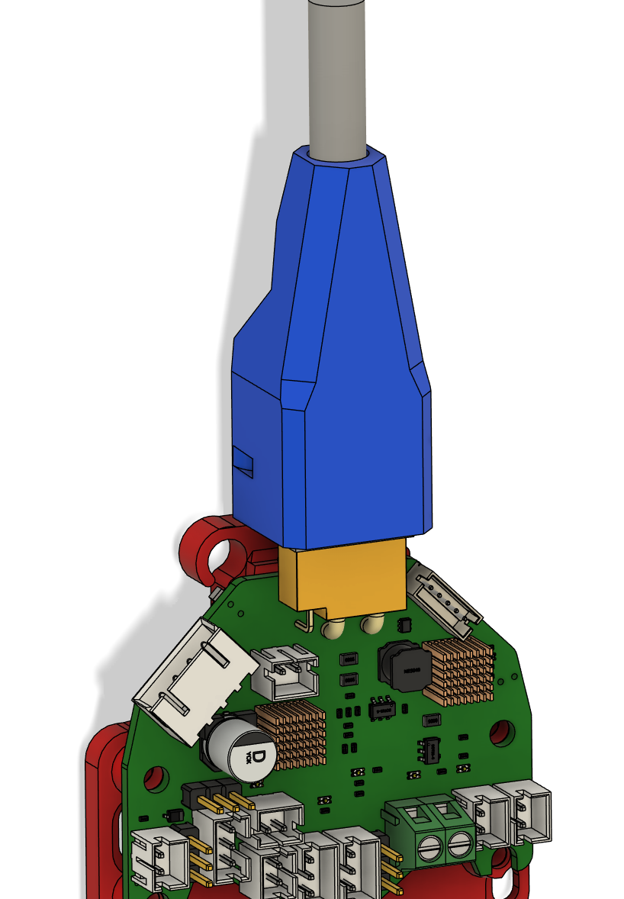
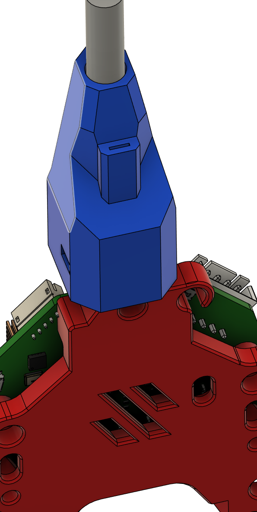
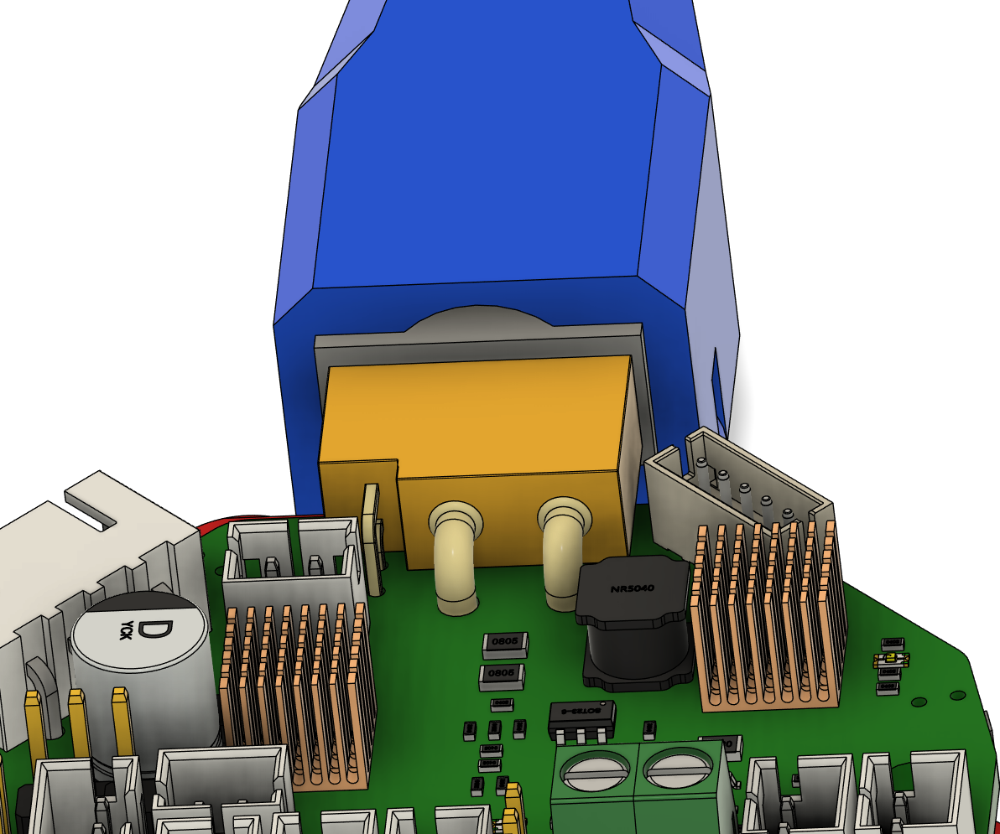
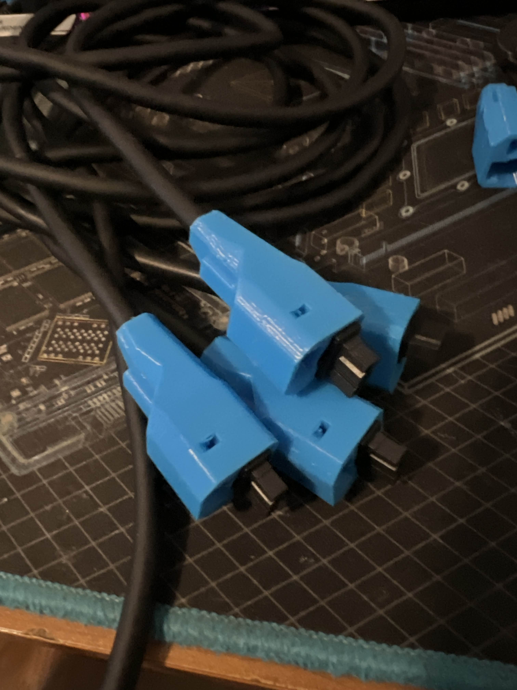
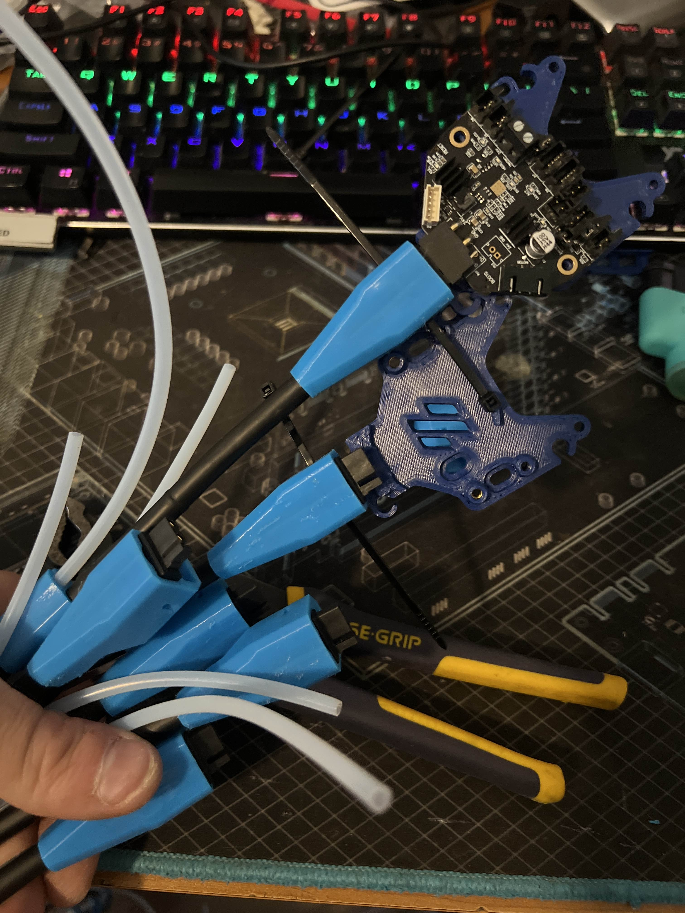
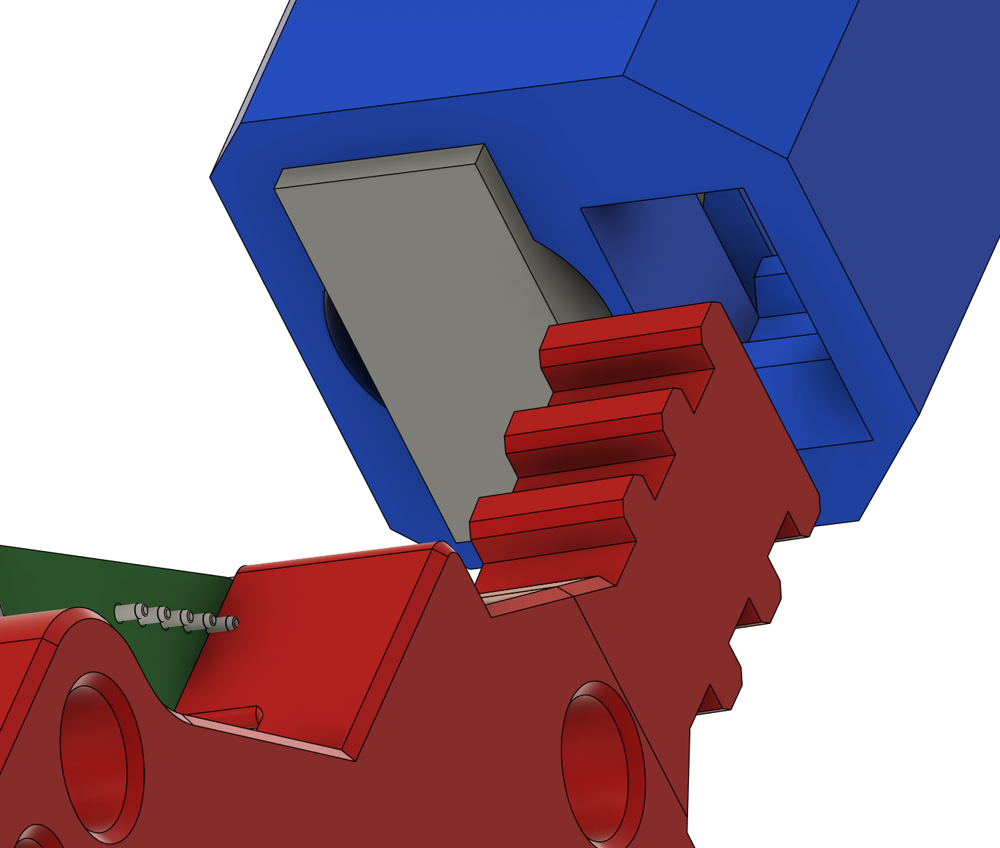

# Umbilical Sock for NiteHawks36

This was designed to properly constrain the connector from flexing the NiteHawk36 and securely mount the umbilical spring steel to the toolhead
this is also specific to [UserMods/TheSin-/PCB36_Mount/PCBMount.stl](../../TheSin-/PCB36_Mount/PCBMount.stl)

<table>
  <tr>
    <td></td>
    <td></td>
    <td></td>
  </tr>
  <tr>
    <td></td>
    <td></td>
  </tr>
</table>

## Assembly

- cable needs to be completely feed thru before **termination!**
- verify that the connector is orientated the properly relative to the PCB
- Push firmmly once aligned with hole while aligning eletrical connector
- TieWrap should be put into the mounting point and the front of the tool, capturing the mount inside the sock.

## Printing Directions

Must be printed in TPU
Print

- No InFill
- 3 walls @ .4

## Bill of Materials (BOM)

- 1 x 2.5mm TieWrap
- Part must be printed from TPU

## Credits

Special thanks to N3MI-DG for basically making this rocket sock look so good!
