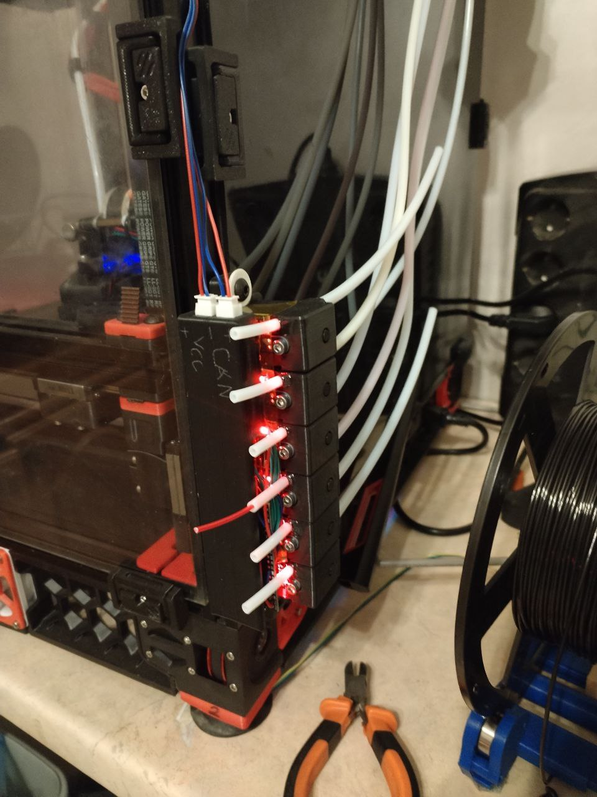

# IllFilamentRunout
Side Mount filament runout sensor that supports 6 filament lines.

## BOM
- 12x MR105 Bearings
- 42x DIN912 M3 x 6mm bolts
- 2x M6 T-nut
- 2x DIN912 M6 x 14mm bolts
- 1x RP2040 board like AITEWIN ROBOT RP2040 Core Board
- 1x SN65HVD230 CAN Bus Transceiver
- 1x MP1584EN DC-DC step down voltage regulator
- 2x JST XH2.54mm 2p male female pair
- 6x EQV Optical speed sensor
- 6x O-ring 10.0-7.0-1.5mm

## Notes
- Install katapult and klipper as on any rp2040 board. Just note what gpio you're using for CAN Tx Rx
- I recommend connecting sensor Vin pint in to DC-DC converter, not to RP board.
- Note that SN65HVD230 uses 3.3 volts
- Use 16-21 pins to connect optical sensors to the board. You can use different pins, but youll have to edit config accordingly.

- Input radius for ptfe tube is 4mm, but output is for 5mm tube

## Credits
Sensor is based on [Filament Progression and Runout sensor](https://www.printables.com/model/629380-filament-progression-and-runout-sensor-optical-end) by [Fractalengineer](https://www.printables.com/@Fractalengine_242936)