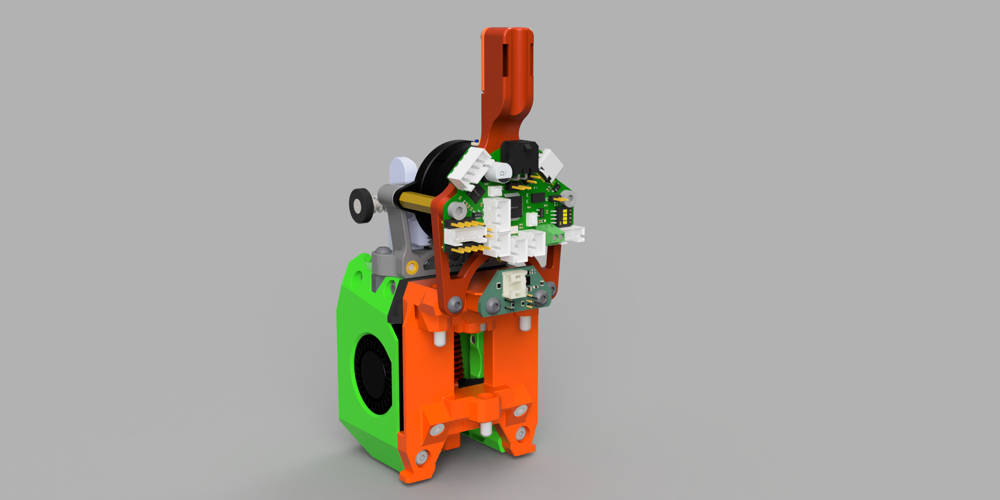

# Anthead AddOns for StealthChanger with Sherpa Mini and EBB36

## PCB Mount for EBB36 with Sherpa Mini

This PCB mount is designed to fit the StealthChanger backplate with an EBB36 and a Sherpa Mini (or other extruders that share the same motor mounting pattern, like the HGX Lite).

The design takes inspiration from a few existing mods:
- The [PCB36 Mount](https://github.com/DraftShift/StealthChanger/tree/main/UserMods/TheSin-/PCB36_Mount) by [TheSin-](https://github.com/TheSin-), which adds 4 contact points for extra rigidity
- The [PCB36 Mount modifications](https://github.com/DraftShift/StealthChanger/tree/main/UserMods/MugenMicko/Anthead%20Sherpa%20Mini%20EBB%2036%20PCB%20Mount) by [MugenMicko](https://github.com/MugenMicko), which add cable openings below the EBB36
- The [EBB36 Umbilical Clip Mount](https://github.com/jwellman80/VoronMods/tree/main/EBB36%20Umbilical%20Clip%20Mount) by [jwellman80](https://github.com/jwellman80), which provides a nice connection to the [umbilical system](https://github.com/DraftShift/CableManagement/tree/main/UserMods/N3MI-DG/Umbilical_plates_V2) by [N3MI-DG](https://github.com/N3MI-DG)

While inspired by these designs, this mount has been completely redrawn from scratch. Compared to the originals, it includes a few modifications. For example, the umbilical connection has a wider opening so you can secure the umbilical cable with either Velcro or cable ties.

**Printing note:** You’ll need to add supports underneath the umbilical handle. Make sure to only support the flat face there and not the inside of the holes, so configure the supports in your slicer specifically for that face.

## StealthChanger Backplate AddOn and Spacer

To make use of the four contact points for the PCB mount, you’ll need the StealthChanger backplate AddOns from [TheSin-’s mod](https://github.com/DraftShift/StealthChanger/tree/main/UserMods/TheSin-/PCB36_Mount). These AddOns are also included in the original StealthChanger Anthead backplate CAD if you want to modify them.

If you use them as-is, there’s quite a bit of extra space between the extruder’s motor mount and the PCB mount. To fix this, I shortened the backplate AddOn to the exact length needed when using 20 mm standoffs and a motor with 2.5 mm thick mounting plates. I also widened the opening on the backplate slightly so I could add a threaded insert instead of screwing directly into plastic.

As an alternative, you can simply use standoffs of a different length with the original backplates (with the AddOn mounting points), or print a spacer and use longer screws.

The Sherpa Mini blocks the cable channels that run from inside the Anthead. To solve this, I modified the spacer between the Anthead and the backplate so that it extends these holes past the Sherpa Mini. This spacer should work universally with any extruder that blocks those channels.
