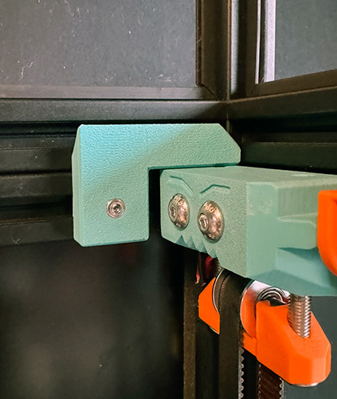

# TopHat Alginer
The extrusion based TopHat can just rest on the Voron on its own. However, you always have to manually put it in the right spot and I might have just had it slide down when I lifted one side of the printer up to look at something in the Electronics Bay. I wanted a simple solution, that fits right next to the Beefy Idlers and locks the TopHat to its corner, as you can see in the picture. It is angled at the top, so the TopHat easily slides down on the four TopHatAligners in each corner.

There are two STLs provided, where the [TopHatAligner B](STLs/TopHatAligner_B.stl) is just a mirrored version of the [TopHatAligner A](STLs/TopHatAligner_A.stl). You need two of each of the four corners of your TopHat. See the following picture for the positioning in the back right corner.

