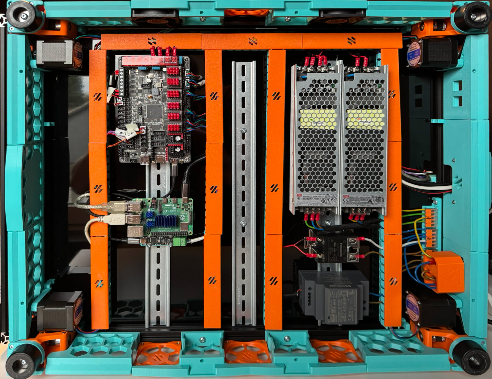

# Modifications for Vorlong +100y with StealthChanger

## Deck Panel 350+100y
[`350_+100y_Deck_Panel.dxf`](Drawing_DXFs/Panels/350_+100y_Deck_Panel.dxf) adds to the original part [`350_Deck_Panel.dxf`](https://github.com/VoronDesign/Voron-2/blob/Voron2.4/Drawing_DXFs/Panels/350_Deck_Panel.dxf) 100mm on the y axis and additional holes for an additional DIN rail.

The original design is described in [`Deck_Panel.PDF`](https://github.com/VoronDesign/Voron-2/blob/Voron2.4/Drawing_DXFs/Panels/Deck_Panel.PDF) and I copied the rounding values from the original dxf files. One could perfectly adapt this manually 1:1 to the Vorlong +100y. However, having an additional 100mm on the y axis adds space for additional DIN rails. This opens up some space for electronics mounting and gives more support for the deck plate. I decided on three DIN rails for my design, although four would fit too.

## Side Skirts
With three DIN rails it makes sense to also have three fans, one blowing across each rail. Therefore I extended the middle fan part by one fan. It is a rather big part. If you don't have a printer that big, you can just cut it in the middle and it will be held together by the fan or the retainer in the middle after assembly. After that, the side skirts needed to be adjusted, to fit the remaining space, which are also provided.

# Credit
Original designs from [Voron Design](https://github.com/VoronDesign) for the [Voron-2](https://github.com/VoronDesign/Voron-2) project.

Also check out the other [Vorlong +100y modifications](https://github.com/DraftShift/StealthChanger/tree/main/UserMods/TheSin-/Vorlong_%2B100y) by [TheSin-](https://github.com/TheSin-), who got me started on the Vorlong idea and provides the basics.