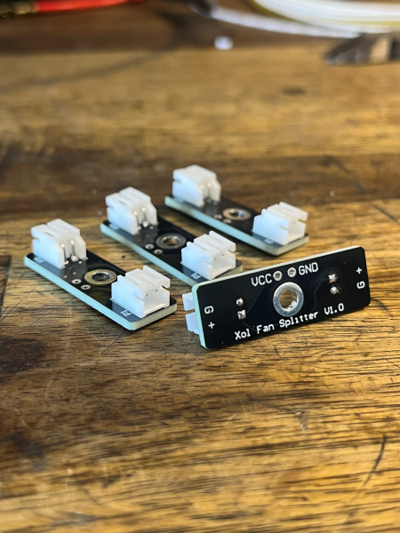
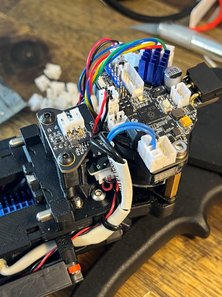
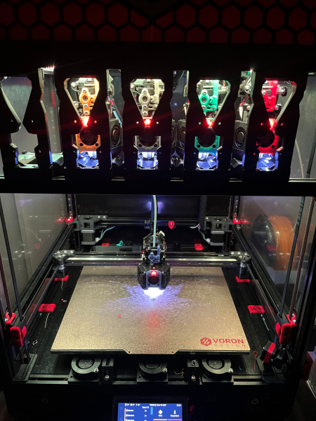

# STEALTHCHANGER A4T / XOL TOOLHEAD FAN SPLITTER

This little PCB allows you to connect 2 part cooling fans without having to splice or join cables. It fits the A4T and Xol toolheads when using them with Stealthchanger by DraftShift Design. Note that this is designed to work with the (current) Stealthchanger V1.1 backplates. If DraftShift Design updates these backplates for any reason I will be revisiting this to make sure it still works with future revisions.

Stealthchanger A4T / Xol fan splitter PCB:

Download the gerber files above, send them to your favourite PCB manufacturing company (I used PCBWay), and buy two right-angled 2-pin JST-PH headers per board. There's a small bit of soldering involved to attach the headers to the PCB, and to attach the 2 cables to run from the fan splitter PCB up to your toolhead board. You'll probably also need to crimp a JST connector onto the cables to attach to your toolhead board, but this is toolhead board-specific.

## BOM

| Item                                                 | QTY |
| ---------------------------------------------------- | --- |
| Xol Fan Splitter PCB (download gerber files above)   |  1  |
| JST PH 2-pin 90 degree header connector (S2B-PH-K-S) |  2  |
| jumper cable from PCB to toolhead PCB                |  2  |
| M3 x 12 mm BHCS                                      |  1  |

## ASSEMBLY

1. Solder the JST headers to the fan plitter PCB. Place the header on the side of the PCB with the rectangle silkscreen.
2. Solder 2 jumper wires to the VCC and GND pads. Insert the cables from the side with the "VCC GND" silkscreen, ie the OPPOSITE side of the board as the headers (See pictures if unsure of orientation). **The spacing of the VCC/GND pads is 2.54mm, so you could even solder a 2-pin Dupont connector if you wanted to**
3. Crimp a JST connector to the jumper wires to connect the fan splitter PCB to your toolhead PCB (Usually JST-PH, but is sometimes JST-XH).
4. Double check you've installed the headers and jumper cables on the correct side of the board to ensure you don't short anything out!!
5. Attach the PCB assembly to Stealthanger Xol V1.1 backplate by using the M3 screw to attach it to the single hole that's there for the stepper motor mounting brace. It will fit with the toolhead board brace installed with plenty of clearance behind the Tap sensor.
6. Connect the 2 part cooling fans to the PCB, and connect the PCB to your toolhead board. Ensure your fans are wired with the correct polarity as specified by the silkscreen.

Assembled Xol toolhead with fan splitter PCB. Note how it tucks neatly above the Tap sensor with the JST headers on the reverse side of the board to save space:

## FAQ
- **Why does this exist?** Because currently as of 2024, most NEMA14 toolhead boards don't have 2 separate part cooling fan ports, and I didn't like the idea of having to splice cables and to not be able to remove a fan without cutting cables.
- **What does it fit?** It's a pretty niche board. If you have a Stealthchanger and you're using the A4T or Xol toolheads by Armchair Heavy Industries, this will fit neatly above the Tap sensor, below the extruder stepper motor.
- **Does it work with any other setup?** Technically it'd work anywhere on a printer you want to have two fans connected to a single port. As long as you've got room to physically fit the board, it'll work.
- **Is this needed?** No! You can quite easily use 2 part cooling fans and crimp / solder both fans ino a single JST connector.
- **Will it improve my prints?** Heck no, but you get extra style points (maybe?)

5 Xol toolheads all fitted with this PCB:

## CREDITS

Credit goes to the hard work by the people at DraftShift Design for their work on the Stealthchanger Voron toolchanger project, and Armchair Heavy Industries for their work on the A4T and Xol toolheads!.

[DraftShift Design](https://github.com/DraftShift)

[Armchair Heavy Industries](https://github.com/Armchair-Heavy-Industries)
