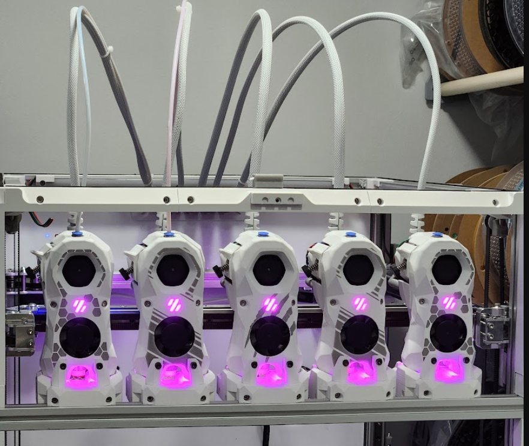
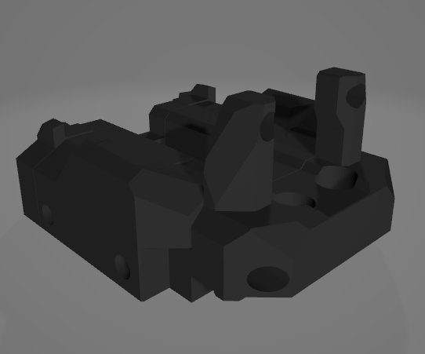

# Stealthburner Minimal Docks (aka Crabby Dock)

I discovered that when using the crossbar with Stealthburner, the vertical supports are no longer necessary. This tweak simplifies the setup and maintains a clean aesthetic without sacrificing functionality.

All credits go to the original team behind Stealthburner, as this is purely a cosmetic change.

