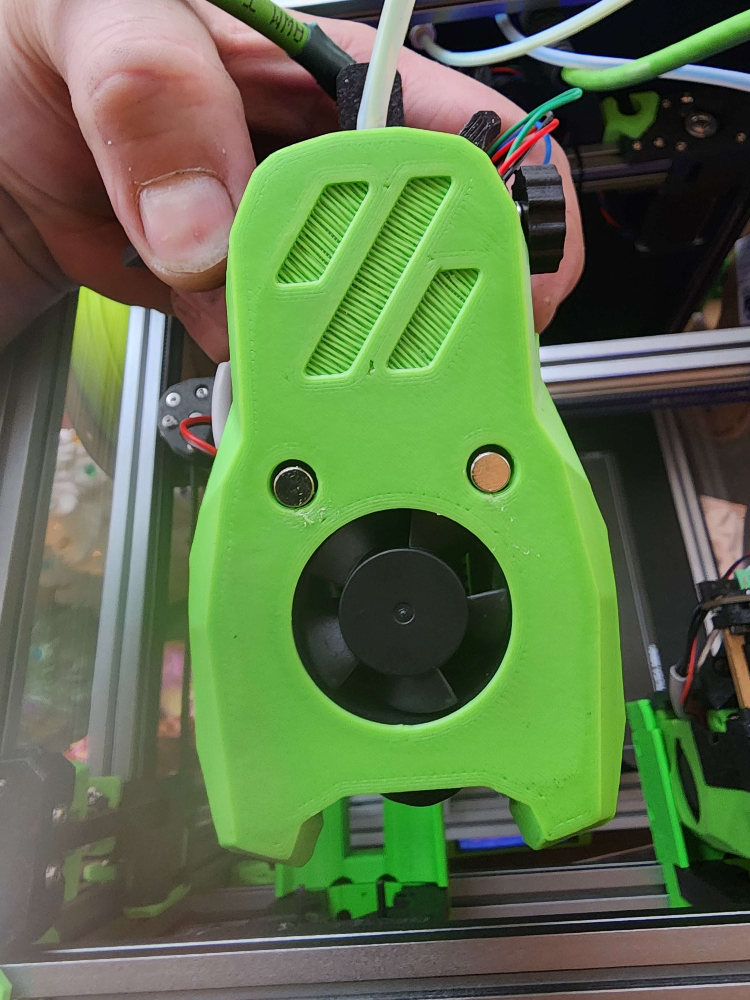
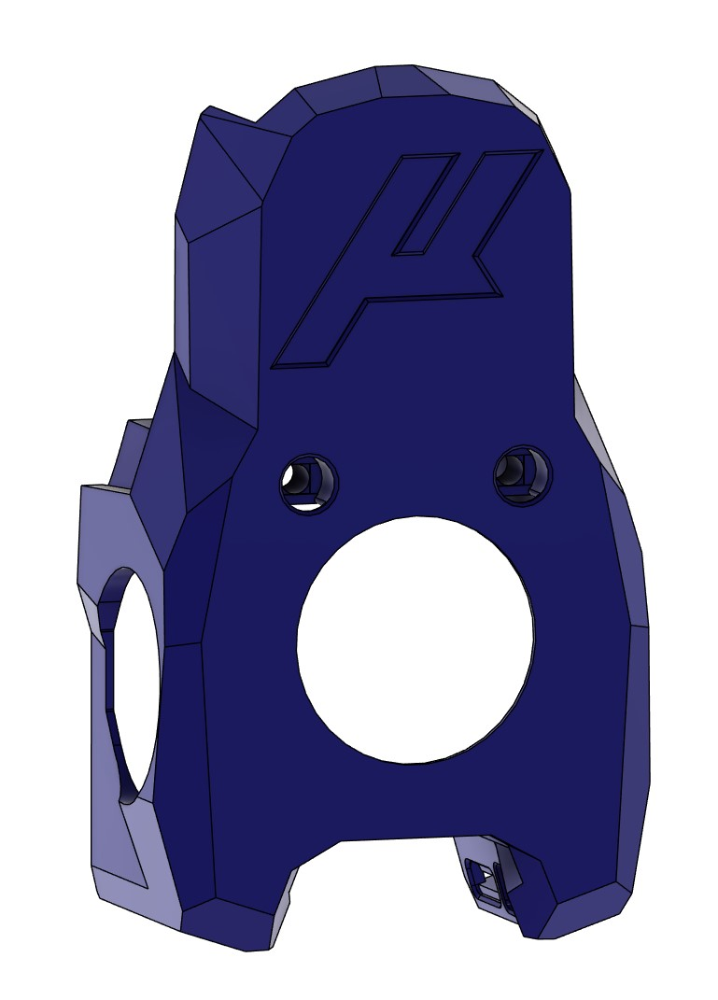
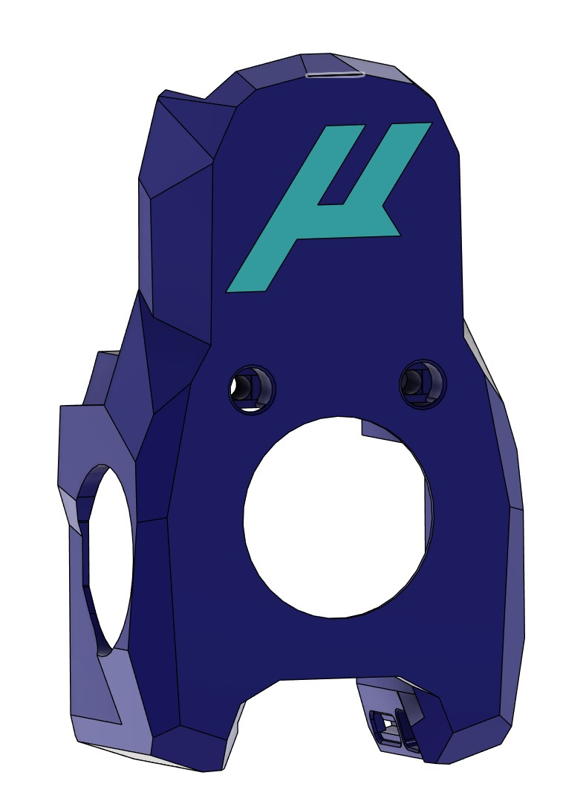

# MiniSB StealthChanger

Mini Stealthburner designed by [Voron Design](https://vorondesign.com/).

## StealthChanger backplate for the MiniSB

### Print list

- Backplate
- Spacer
- Modified Cowl ( which adds extra mount points )
  - Voron Logo Option -> `STL's/Cowl.stl`
  - Micron Logo Option -> `STL's/Micron_Cowl.stl`
  - Micron 2Colors Logo Option ->
    - `STL's/Micron_MultiColor_Cowl.stl`
    - `STL's/Micron_MultiColor_Logo.stl`

### BOM (On top of the normal DragonBurner Backplate BOM)

- 4 M3 Heat inserts (Voron standard)
- 2 M3x40 BHCS or SHCS (Ferrous, magnetic)
- 2 M3x10 BHCS

