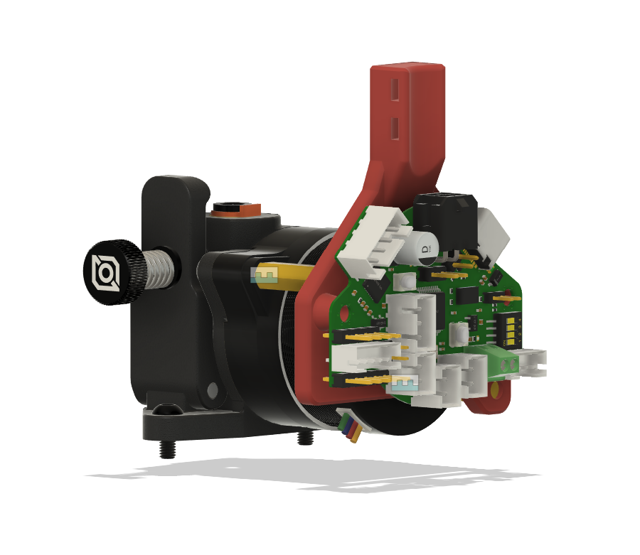
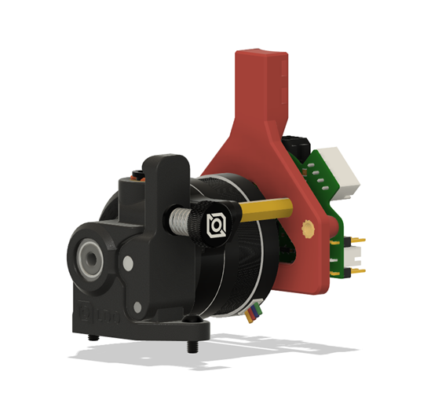

# Orbiter V2 BTT EBB36 carrier

 

Since the extuder motor on Orbiter V2 sits quite low, the EBB36 will interfere with the optotap PCB on some toolhead backplates (Dragon Burner and Yavoth, maybe more). So I created this PCB carrier that places the EBB36 a few mm higher than other existing mounts, and also tried to make it as rigid as possible without extra structures or modifications. 

Parts:
* Standoffs included with the EBB36
* 2 M3 BHCS to secure the mount agianst the standoffs
* 2 M3 SHCS to secure the EBB36 to the mount
* Optional: 2 M3 5x4 heat inserts (print the corresponding STL)

It is modelled to real-world dimesions and works fine as-is with ABS for me, but you can consider slicing with appropriate shrinkage compensation for your specific filament for the best possible fit.