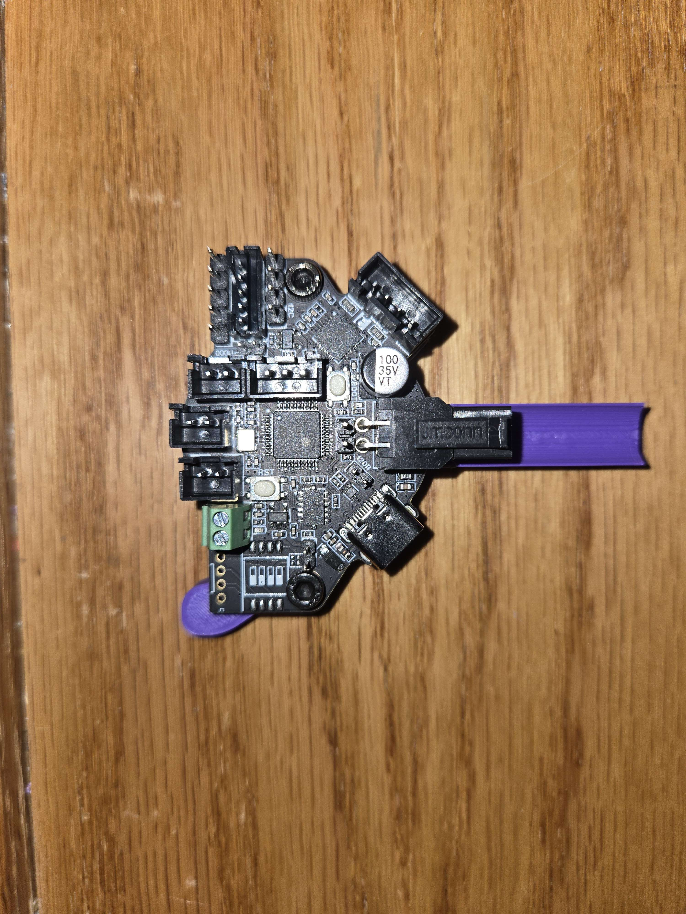
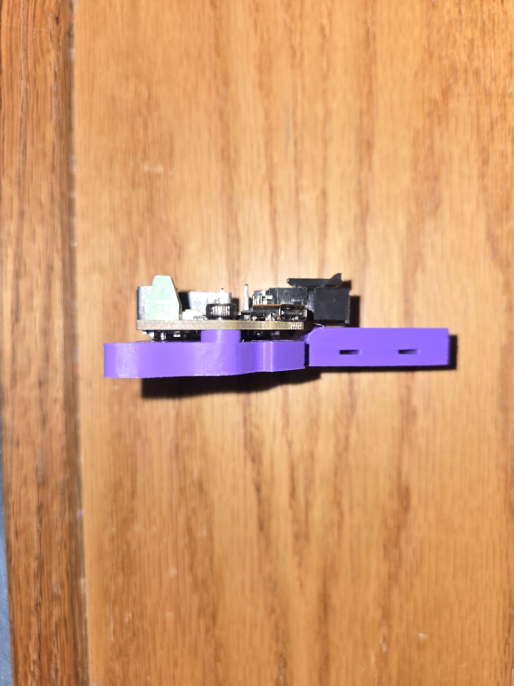
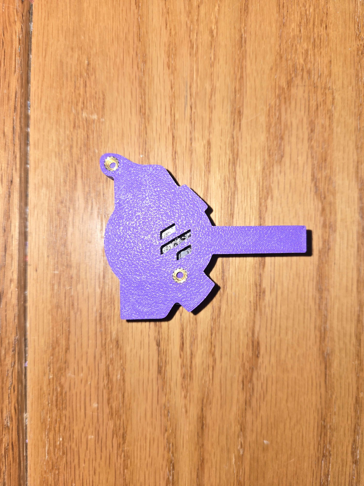

# EBB36 and Galileo 2 Standalone User Mod

## Overview

This user mod provides compatibility between the [EBB36](https://example.com/ebb36) and the [Galileo 2 Standalone](https://github.com/JaredC01/Galileo2/tree/main/galileo2_standalone) system. The mod enables seamless integration, allowing users to utilize these two components together efficiently.

*Image of the Galileo 2 Stand Alone device*

  
*Image of the Galileo 2 Standalone system*

## Features

- **Compatibility**: Ensures that the EBB36 can directly interface with the Galileo 2 Standalone.

## Installation
2 - M3x40 cap bolts with 100% Threads https://a.co/d/dL6dTwI 
4 - M3x5x4 Threaded inserts https://a.co/d/jbFK0In

1. **Download the Mod**: Obtain the latest version of the user mod from the [releases page](UserMods/seenit783).

2. Refer to the [Galileo 2 Standalone configuration guide](https://github.com/JaredC01/Galileo2/tree/main/galileo2_standalone) for detailed configuration instructions.

## Contributing

If you have suggestions for improvements or encounter bugs, please open an issue on the [GitHub repository](https://example.com/issues). Contributions are welcome, and you can submit a pull request to enhance the mod.

## License

This mod is licensed under the [MIT License](https://example.com/license). See the `LICENSE` file for more details.

## Contact
Angus MacLeod On Discord

For further assistance, you can contact the mod author at [richardferrington@gmail.com](mailto:richardferrington@gmail.com).
Angus MacLeod on Discord
---

Thank you for using the EBB36/Galileo 2 Standalone User Mod. We hope it enhances your experience with your toolheads!

