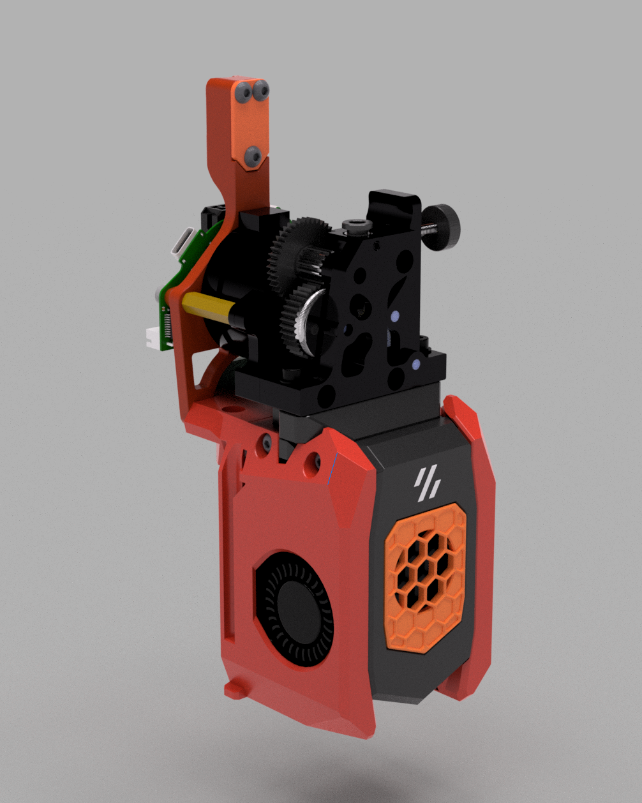

# AntHead HGX‑Lite Adaptor and Backplate

This UserMod adds a **spacer plate** and a **modified backplate** so an
**HGX‑Lite extruder** can be used on AntHead together with **Tavroswyn's EBB36
mount** (rear CAN toolhead board).

In practice, the HGX‑Lite body is raised and the rear heat‑set mounting bosses
on the backplate are extended to match the HGX-Lite's mounting.

> **Note:** The geometry was designed with a 22mm deep stepper in wind with 20mm
> standoffs. If your stepper is longer you may need to adjust things.

## Contents

Files in this folder:

- `AntHead_HGX_Adaptor_Plate.step`
- `Anthead_HGX_Adaptor_Plate.3mf`
	- Spacer plate that sits between the AntHead main body and the HGX‑Lite
		extruder, lifting it by 7.25 mm and matching the bolt pattern.

- `Anthead_Backplate_HGX_Lite.step`
- `Anthead_Backplate_HGX_Lite_SF.3mf`
- `Anthead_Backplate_HGX_Lite_HF.3mf`
	- Modified AntHead backplate with the EBB36 mounting pattern and extended
		rear heat‑set locations.
	- `SF` and `HF` variants correspond to **Standard‑flow** and **High‑flow**
		AntHead setups. (UHF is not currently included.)

## Credits

- The HGX‑Lite backplate variant in this folder is based on and adapted from the
  AntHead backplate work by [Tavroswyn](../../../Tavroswyn/Anthead/README.md)
